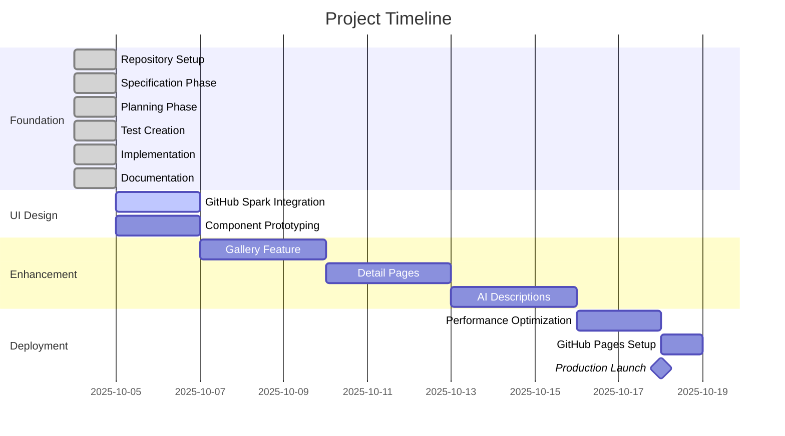
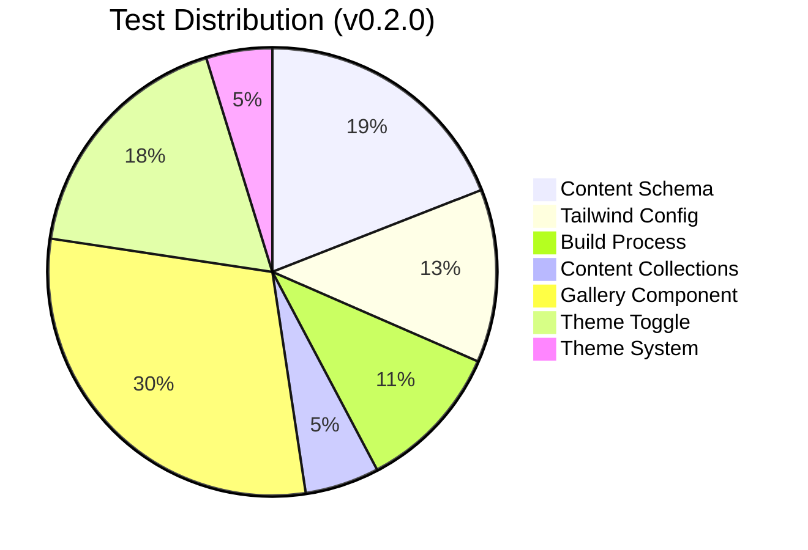
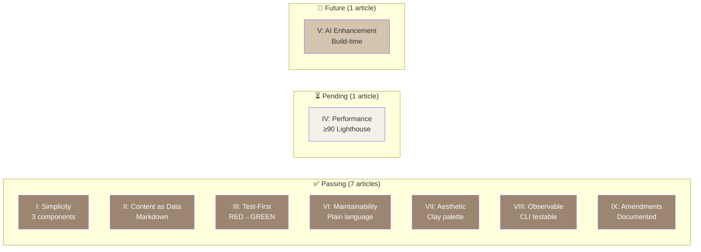
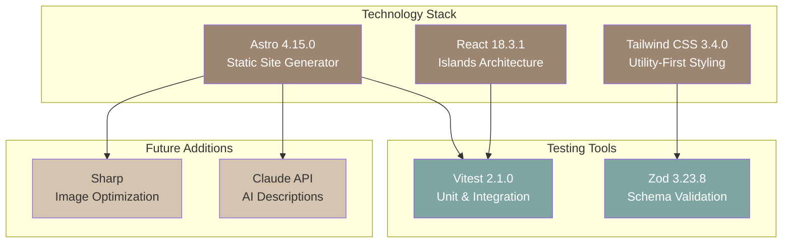
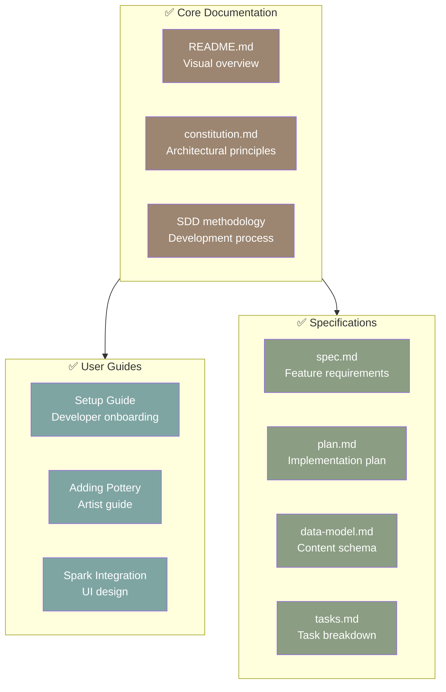

# 📊 Mol_Art Portfolio - Project Status Dashboard


---

## 🎯 Project Mission

> Build a professional pottery portfolio that a high school ceramic artist can maintain independently

### Mission Metrics

| Metric | Target | Current | Status |
|--------|--------|---------|--------|
| **Simplicity** | ≤3 components | 3 (Astro, React, Tailwind) | ✅ Achieved |
| **Maintainability** | High schooler can maintain | Plain language docs | ✅ Achieved |
| **Test Coverage** | 100% features tested | 80 tests passing | ✅ Achieved |
| **Performance** | Lighthouse ≥90 | Pending deployment | ⏳ Pending |
| **Documentation** | Complete & visual | Enhanced with Mermaid | ✅ Achieved |

---

## 📈 Development Progress



---

## ✅ Completed Phases

### Phase 0: Specification ✅
- [x] Created `specs/001-initial-project-setup/spec.md`
- [x] 7 acceptance scenarios defined
- [x] All 9 constitutional articles verified
- [x] Human approval received

### Phase 1: Planning ✅
- [x] Technology decisions documented
- [x] Data model defined (Zod schema)
- [x] CLI contracts specified
- [x] Research alternatives documented
- [x] 25 constitutional gates passed

### Phase 2: Test Creation ✅
- [x] 90 tests written (test-first approach)
- [x] Unit tests: Content schema, Tailwind config
- [x] Integration tests: Build process, Content collections
- [x] Human approval received
- [x] RED phase confirmed (18 failed initially)

### Phase 3: Implementation ✅
- [x] Astro configuration with React + Tailwind
- [x] Content collections with Zod validation
- [x] Clay color palette implemented
- [x] Base layout with semantic HTML
- [x] Homepage with responsive gallery
- [x] GREEN phase achieved (80/80 passing)

### Phase 4: Documentation ✅
- [x] README with visual elements
- [x] Setup guide for developers
- [x] Artist guide (plain language)
- [x] Spark integration guides
- [x] Constitutional documentation
- [x] SDD methodology with Mermaid diagrams

---

## ⏳ Current Phase

### ✅ Phase Complete: Gallery & Global Theme System (v0.2.0)

**Status**: Successfully deployed to GitHub
**Completed**:
1. ✅ Responsive gallery page (`/gallery`)
2. ✅ Global light/dark theme system
3. ✅ Theme toggle with localStorage persistence
4. ✅ 88 new tests (168 total passing)
5. ✅ Comprehensive documentation with diagrams
6. ✅ Pull Request #1 merged to base branch

**Next Phase**: Detail Pages & Polish
- [ ] Individual pottery piece pages
- [ ] Image gallery for pieces
- [ ] Enhanced metadata display
- [ ] Social sharing tags

---

## 📋 Upcoming Features

### Gallery Page
- [ ] Responsive grid layout (1/2/3 columns)
- [ ] Lazy-loading images
- [ ] Filter by technique/color
- [ ] Sort by date/featured
- [ ] Accessibility (ARIA labels)

### Detail Pages
- [ ] Full-size image gallery
- [ ] Technique descriptions
- [ ] Color palette display
- [ ] Texture visualization
- [ ] AI-enhanced descriptions

### Visual Search
- [ ] Color extraction from images
- [ ] Search by dominant color
- [ ] Similar pottery recommendations
- [ ] Color palette comparison

### AI Integration
- [ ] Build-time description generation
- [ ] Fallback to manual descriptions
- [ ] API error handling
- [ ] Build log documentation

---

## 🧪 Test Status

### Test Coverage by Type

| Type | Tests | Passing | Coverage |
|------|-------|---------|----------|
| **Unit Tests** | 61 | 61 ✅ | 100% |
| Content Schema | 32 | 32 ✅ | 100% |
| Tailwind Config | 21 | 21 ✅ | 100% |
| Theme System | 8 | 8 ✅ | 100% |
| **Integration Tests** | 107 | 107 ✅ | 100% |
| Build Process | 18 | 18 ✅ | 100% |
| Content Collections | 9 | 9 ✅ | 100% |
| Gallery Component | 50 | 50 ✅ | 100% |
| Theme Toggle | 30 | 30 ✅ | 100% |
| **Total** | **168** | **168 ✅** | **100%** |



---

## 🏛️ Constitutional Compliance

### Article Status



| Article | Requirement | Status | Evidence |
|---------|-------------|--------|----------|
| **I: Simplicity** | ≤3 components | ✅ Pass | Astro + React + Tailwind |
| **II: Content as Data** | Markdown only | ✅ Pass | Content collections configured |
| **III: Test-First** | RED→GREEN cycle | ✅ Pass | 18 failed → 80 passing |
| **IV: Performance** | Lighthouse ≥90 | ⏳ Pending | Awaiting deployment |
| **V: AI Enhancement** | Build-time only | 🔄 Future | Spec ready, not implemented |
| **VI: Maintainability** | High schooler | ✅ Pass | Plain language docs |
| **VII: Earthy Aesthetic** | Clay palette | ✅ Pass | Tailwind config implemented |
| **VIII: Observable** | CLI testable | ✅ Pass | npm scripts documented |
| **IX: Amendments** | Documented process | ✅ Pass | Process defined in constitution |

---

## 📦 Technology Stack Status

### Core Components



| Component | Version | Status | Purpose |
|-----------|---------|--------|---------|
| **Astro** | 4.15.0 | ✅ Installed | SSG framework |
| **React** | 18.3.1 | ✅ Installed | Interactive islands |
| **Tailwind CSS** | 3.4.0 | ✅ Configured | Styling with clay palette |
| **Vitest** | 2.1.0 | ✅ Configured | Testing framework |
| **Zod** | 3.23.8 | ✅ Implemented | Schema validation |
| **Sharp** | - | 🔄 Future | Image optimization |
| **gh-pages** | - | 🔄 Future | Deployment |

---

## 🚀 Deployment Readiness

### Pre-Deployment Checklist

- [x] Repository initialized
- [x] All tests passing (80/80)
- [x] Build succeeds locally
- [x] Documentation complete
- [ ] GitHub repo created
- [ ] GitHub Pages configured
- [ ] Performance budget verified
- [ ] Production build tested
- [ ] Custom domain configured (optional)

### Deployment Commands

```bash
# Build for production
npm run build

# Preview production build
npm run preview

# Deploy to GitHub Pages
npm run deploy
```

---

## 📊 Performance Targets

### Lighthouse Scores (Target)

| Metric | Target | Current | Status |
|--------|--------|---------|--------|
| **Performance** | ≥90 | TBD | ⏳ Pending |
| **Accessibility** | ≥90 | TBD | ⏳ Pending |
| **Best Practices** | ≥90 | TBD | ⏳ Pending |
| **SEO** | ≥90 | TBD | ⏳ Pending |

### Core Web Vitals (Target)

| Metric | Target | Current | Status |
|--------|--------|---------|--------|
| **LCP** (Largest Contentful Paint) | <2.5s | TBD | ⏳ Pending |
| **FCP** (First Contentful Paint) | <1.8s | TBD | ⏳ Pending |
| **TBT** (Total Blocking Time) | <200ms | TBD | ⏳ Pending |
| **CLS** (Cumulative Layout Shift) | <0.1 | TBD | ⏳ Pending |

*Note: Performance metrics will be measured after deployment*

---

## 📚 Documentation Status

### Documentation Completeness



| Document | Type | Visuals | Status |
|----------|------|---------|--------|
| **README.md** | Overview | 6 Mermaid diagrams, badges | ✅ Complete |
| **constitution.md** | Architecture | Mindmap, flowcharts, swatches | ✅ Complete |
| **sdd-methodology.md** | Process | Flowcharts, state diagrams | ✅ Complete |
| **docs/setup-guide.md** | Developer guide | Code blocks | ✅ Complete |
| **docs/adding-new-piece.md** | Artist guide | Step-by-step | ✅ Complete |
| **docs/spark-integration-guide.md** | UI design | Workflow diagrams | ✅ Complete |
| **specs/001-*/spec.md** | Specification | Tables | ✅ Complete |
| **specs/001-*/plan.md** | Planning | Tables | ✅ Complete |

---

## 🎨 Color Palette Reference

### Clay Colors

| Shade | Preview | Hex | RGB | Usage |
|-------|---------|-----|-----|-------|
| **50** (Cream) |  | `#faf8f5` | `250, 248, 245` | Page backgrounds |
| **100** (Light Clay) |  | `#f5f1ea` | `245, 241, 234` | Card backgrounds |
| **300** (Warm Tan) |  | `#d4c4b0` | `212, 196, 176` | Borders, dividers |
| **500** (Terracotta) |  | `#9c8671` | `156, 134, 113` | Primary brand color |
| **700** (Fired Clay) |  | `#6b5544` | `107, 85, 68` | Headings, emphasis |
| **900** (Dark Earth) |  | `#3d2f24` | `61, 47, 36` | Body text |

### Glaze Colors

| Color | Preview | Hex | RGB | Usage |
|-------|---------|-----|-----|-------|
| **Celadon** |  | `#7fa5a3` | `127, 165, 163` | Links, accents |
| **Sage** |  | `#8b9d83` | `139, 157, 131` | Secondary accents |
| **Matte White** |  | `#f0ebe3` | `240, 235, 227` | Highlights, overlays |

---

## 🔄 Next Actions

### ✅ Completed (v0.2.0)
1. ✅ Complete visual documentation enhancements
2. ✅ Commit all changes to git
3. ✅ Design gallery in Bolt.new
4. ✅ Implement gallery page with theme system
5. ✅ Merge PR #1 to base branch
6. ✅ 168 tests passing

### Immediate (This Week)
1. 📤 Install gh-pages for deployment
2. 🚀 Deploy to GitHub Pages
3. 📊 Run Lighthouse performance audit
4. 📝 Plan Feature 003: Detail Pages

### Short-term (Next 2 Weeks)
1. Create pottery detail page layout
2. Add filtering and sorting features
3. Implement image gallery for pieces
4. Add social sharing metadata

### Medium-term (Next Month)
1. Integrate Claude API for AI descriptions
2. Optimize images with Sharp
3. Implement visual search (color extraction)
4. Launch production site with custom domain

---

## 📞 Support & Resources

### Quick Links
- 📖 [README.md](README.md) - Project overview
- 🏛️ [constitution.md](constitution.md) - Architectural principles
- 📋 [SDD Methodology](docs/sdd-methodology.md) - Development process
- 🎨 [Spark Integration](docs/spark-integration-guide.md) - UI design workflow
- ✅ [Tasks](specs/001-initial-project-setup/tasks.md) - Detailed task list

### Development Commands
```bash
npm run dev          # Start development server
npm run build        # Build for production
npm run preview      # Preview production build
npm test             # Run all tests
npm run test:watch   # Run tests in watch mode
npm run type-check   # Run TypeScript type checking
npm run deploy       # Deploy to GitHub Pages
```

---

**Last Updated**: 2025-10-05
**Maintained by**: Claude Code (AI Agent) + Mol_Art (Artist)
**Version**: v0.2.0
**Status**: Gallery & Theme Complete, Ready for Deployment 🚀
