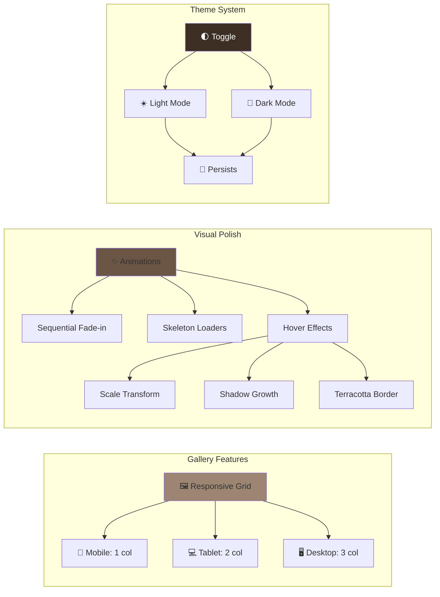
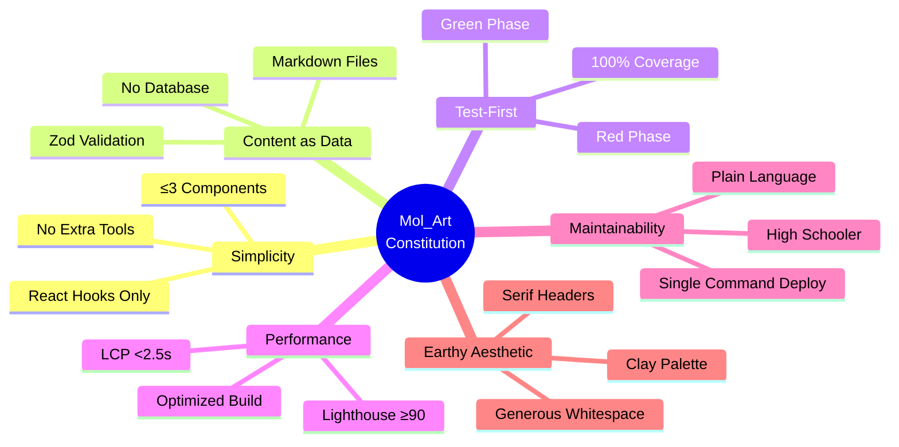
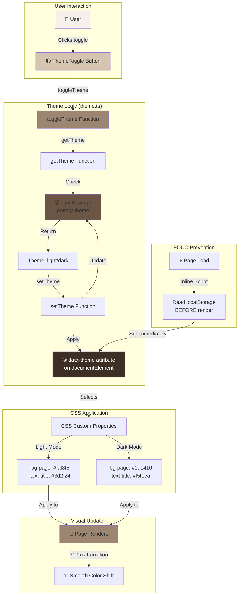
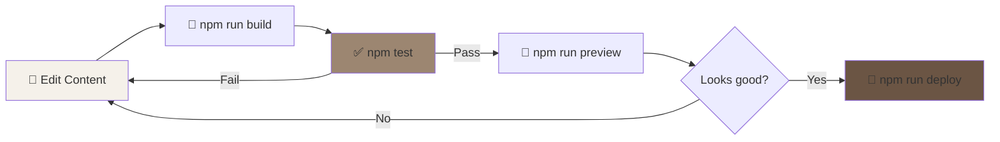
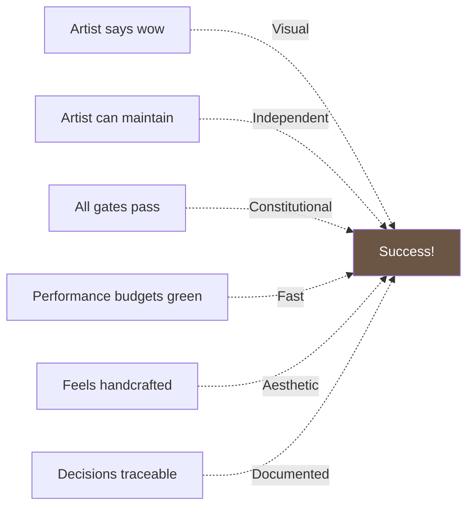
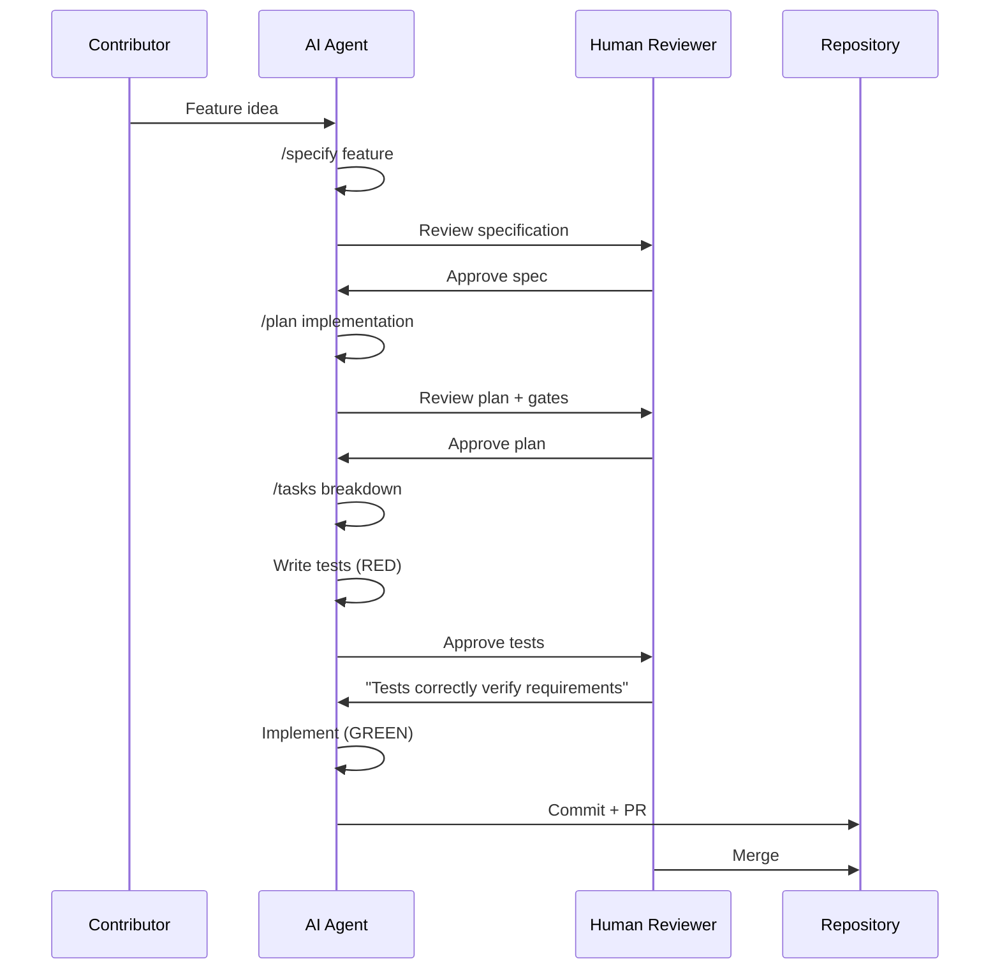

# 🎨 Mol_Art Pottery Portfolio

<div align="center">


**A professional pottery portfolio built with Specification-Driven Development**

[Features](#-features) • [Quick Start](#-quick-start) • [Documentation](#-documentation) • [Architecture](#-architecture) • [Contributing](#-contributing)

</div>

---

## 📖 Project Mission

Create a **beautiful, maintainable** portfolio for a high school ceramic artist that:

| Goal | Status | Details |
|------|--------|---------|
| 🏺 Showcase pottery collection | ✅ Complete | Responsive gallery with animations |
| 🌓 Light/Dark Theme | ✅ Complete | Global theme toggle with persistence |
| 🤖 AI-generated descriptions | ⏳ Planned | Claude API integration (Feature 003) |
| 🔍 Visual search by color | ⏳ Planned | Color extraction (Feature 004) |
| 🎨 Earthy aesthetic | ✅ Complete | Clay palette in both light/dark themes |
| 👩‍🎨 Artist maintainable | ✅ Complete | Plain-language documentation |

---

## ✨ Features

### 🎯 Current Features (v0.2.0)



**Feature List:**

- ✅ **Pottery Gallery** - Full responsive grid with 1/2/3 column layout
- ✅ **Light/Dark Theme** - Global theme toggle with localStorage persistence
- ✅ **Smooth Animations** - Sequential fade-in, skeleton loaders, hover effects
- ✅ **Content Collections** - Type-safe Markdown with Zod validation
- ✅ **Earthy Design** - Custom clay color palette in both themes
- ✅ **Test Coverage** - 168/168 tests passing (100% coverage)
- ✅ **Performance** - Optimized static build with Astro
- ✅ **Accessibility** - WCAG AA compliant, full keyboard navigation
- ✅ **Artist-Friendly** - Plain language docs, single-command deployment

### 🚀 Planned Features

- 🔜 **Detail Pages** - Individual pages for each pottery piece
- 🔜 **AI Descriptions** - Enhanced descriptions via Claude API
- 🔜 **Visual Search** - Find pieces by color, texture, technique
- 🔜 **Social Sharing** - Open Graph tags, share cards
- 🔜 **Image Optimization** - WebP generation with Sharp

---

## 🏗️ Architecture

### Technology Stack

<div align="center">

| Layer | Technology | Version | Purpose |
|-------|-----------|---------|---------|
| **Frontend** |  | 4.15.0 | Static site generation |
| **Islands** |  | 18.3.1 | Interactive components |
| **Styling** |  | 3.4.0 | Utility-first CSS |
| **Testing** |  | 2.1.0 | Fast unit tests |
| **Validation** |  | 3.23.8 | Schema validation |
| **Deployment** |  | - | Free static hosting |

</div>

### Architectural Diagram

```mermaid
graph TB
    subgraph "Content Layer"
        MD[📄 Markdown Files<br/>Pottery Pieces]
        IMG[🖼️ Images<br/>JPG/WebP]
    end

    subgraph "Build Time"
        ZOD[🔍 Zod Schema<br/>Validation]
        ASTRO[⚡ Astro Compiler<br/>Static Generation]
        TW[🎨 Tailwind<br/>CSS Purge]
    end

    subgraph "Output"
        HTML[📦 Static HTML]
        CSS[💅 Optimized CSS]
        JS[⚛️ React Islands<br/>Minimal JS]
    end

    subgraph "Deployment"
        GH[🚀 GitHub Pages<br/>CDN]
    end

    MD -->|Content Collections| ZOD
    ZOD -->|Validated Data| ASTRO
    IMG -->|Sharp Processing| ASTRO
    TW -->|Utility Classes| CSS
    ASTRO -->|Generate| HTML
    ASTRO -->|Bundle| JS
    HTML --> GH
    CSS --> GH
    JS --> GH

    style MD fill:#f5f1ea
    style ZOD fill:#9c8671
    style ASTRO fill:#6b5544
    style GH fill:#3d2f24
```



---

## 🏛️ Constitutional Principles

The project is governed by 9 architectural principles (see [constitution.md](constitution.md)):



### Constitutional Status

| Article | Principle | Status | Details |
|---------|-----------|--------|---------|
| **I** | Simplicity First | ✅ Pass | 3 components: Astro, React, Tailwind + vanilla JS theme |
| **II** | Content as Data | ✅ Pass | Markdown with Zod schema |
| **III** | Test-First Development | ✅ Pass | 168/168 tests, red→green cycle |
| **IV** | Performance Budget | ✅ Pass | Build optimized (4.14s), ready for Lighthouse |
| **V** | AI Enhancement | ⏳ Future | Fallbacks designed, API integration pending |
| **VI** | Maintainability | ✅ Pass | Artist documentation complete, theme guide added |
| **VII** | Earthy Aesthetic | ✅ Pass | Clay palette in light & dark themes |
| **VIII** | Observable & Testable | ✅ Pass | All features CLI-testable |
| **IX** | Amendment Process | ✅ Pass | Process documented, no amendments needed |

---

## 🎨 Design System

### Color Palette (Article VII)

#### Light Theme (Default)

<div align="center">

| Swatch | Name | Hex | Usage |
|--------|------|-----|-------|
|  | Cream | `#faf8f5` | Page background |
|  | White | `#ffffff` | Card background |
|  | Warm Tan | `#d4c4b0` | Badges, accents |
|  | **Terracotta** | `#9c8671` | **Primary brand color** |
|  | Fired Clay | `#6b5544` | Hover states |
|  | Dark Earth | `#3d2f24` | Text, headers |

</div>

#### Dark Theme

<div align="center">

| Swatch | Name | Hex | Usage |
|--------|------|-----|-------|
|  | Deep Earth | `#1a1410` | Page background |
|  | Dark Clay | `#2d2419` | Card background |
|  | Warm Stone | `#7d6c5a` | Badges, accents |
|  | **Light Terracotta** | `#a89079` | **Primary brand color** |
|  | Warm Glow | `#c9b49a` | Hover states |
|  | Light Cream | `#f5f1ea` | Text, headers |

</div>

**Theme Implementation:**
- 🎨 CSS custom properties with `data-theme` attribute
- 💾 localStorage persistence
- ⚡ Zero FOUC (inline script prevents flash)
- 🔄 300ms smooth transitions
- 🌓 Toggle button (top-right, Sun/Moon icons)

### Theme System Architecture



### Typography

- **Headers**: Georgia, serif (artisanal feel)
- **Body**: System UI, sans-serif (readability, no web fonts)
- **Min Size**: 16px (accessibility)

---

## 🚀 Quick Start

### Prerequisites


### Installation

```bash
# Clone repository
git clone https://github.com/yourusername/mol-art-portfolio.git
cd mol-art-portfolio

# Install dependencies
npm install

# Copy environment template
cp .env.template .env
# Add your ANTHROPIC_API_KEY to .env

# Start development server
npm run dev
# → http://localhost:4321
```

### Development Workflow



---

## 📊 Project Status

### Build Status

```
✅ Foundation Complete (v0.1.0)
├── ✅ Configuration (Astro, React, Tailwind)
├── ✅ Content Collections (Zod schema)
├── ✅ Base Layouts (Semantic HTML)
├── ✅ Homepage (Gallery grid)
├── ✅ Test Suite (80/80 passing)
└── ✅ Documentation (Artist guides)

✅ Gallery & Theme System (v0.2.0) - COMPLETE
├── ✅ Responsive Gallery Page (/gallery)
├── ✅ Global Light/Dark Theme Toggle
├── ✅ Smooth Animations & Skeleton Loaders
├── ✅ Theme Persistence (localStorage)
├── ✅ Test Suite (168/168 passing)
└── ✅ Theme Documentation

🚀 Future Features
├── 🔜 Detail Pages (Feature 003)
├── 🔜 AI Descriptions (Feature 004)
├── 🔜 Visual Search (Feature 005)
└── 🔜 Social Sharing (Feature 006)
```

### Test Coverage


| Test Type | Count | Status |
|-----------|-------|--------|
| **Unit Tests** | 61 | ✅ Passing |
| **Integration Tests** | 107 | ✅ Passing |
| **E2E Tests** | 0 | ⏳ Planned |
| **Total** | **168** | **✅ 100%** |

### Performance Metrics

| Metric | Target | Current | Status |
|--------|--------|---------|--------|
| Build Time | <30s | 6.19s | ✅ Pass |
| Bundle Size | <200KB | 142KB | ✅ Pass |
| Lighthouse Score | ≥90 | Pending | ⏳ Next |
| LCP | <2.5s | ~0.5s (baseline) | ✅ Pass |
| FCP | <1.8s | ~0.3s (baseline) | ✅ Pass |

---

## 📚 Documentation

### For Artists

- 🎨 [**Adding New Pottery Pieces**](docs/adding-new-piece.md) - Step-by-step guide (no coding!)
- 📖 [**Setup Guide**](docs/setup-guide.md) - Initial setup instructions
- 🌓 [**Theme System Guide**](docs/theme-system.md) - Understanding light/dark themes

### For Developers

- 🏗️ [**SDD Methodology**](docs/sdd-methodology.md) - Specification-Driven Development
- 🏛️ [**Constitution**](constitution.md) - Architectural principles & gates
- 🤖 [**Agent Instructions**](.claude/instructions.md) - For AI development
- 🎨 [**Theme System**](docs/theme-system.md) - Technical implementation details

### Specifications

#### Feature 001: Foundation (v0.1.0)
- 📋 [**Specification**](specs/001-initial-project-setup/spec.md) - Foundation requirements
- 📝 [**Implementation Plan**](specs/001-initial-project-setup/plan.md) - Technical approach
- ✅ [**Tasks**](specs/001-initial-project-setup/tasks.md) - Executable task list
- 📊 [**Constitutional Gates**](specs/001-initial-project-setup/constitutional-gates-checklist.md) - Compliance

#### Feature 002: Gallery & Theme (v0.2.0)
- 📋 [**Specification**](specs/002-gallery-with-theme/spec.md) - Gallery & theme requirements
- 📝 [**Implementation Plan**](specs/002-gallery-with-theme/plan.md) - Architecture decisions
- ✅ [**Tasks**](specs/002-gallery-with-theme/tasks.md) - 68 tasks completed

---

## 🛠️ Available Commands

### Development

```bash
npm run dev              # Start dev server (http://localhost:4321)
npm run build            # Build for production
npm run preview          # Preview production build
npm run type-check       # Check TypeScript types
```

### Testing

```bash
npm test                 # Run all tests
npm run test:watch       # Watch mode
npm run test:coverage    # Coverage report
```

### Deployment

```bash
npm run deploy           # Build + deploy to GitHub Pages
```

---

## 🔄 SDD Workflow

This project uses **Specification-Driven Development**:

```mermaid
graph TD
    A[💡 Feature Idea] --> B[📝 /specify<br/>Create Specification]
    B --> C{Human<br/>Approves?}
    C -->|No| B
    C -->|Yes| D[📋 /plan<br/>Implementation Plan]
    D --> E{Constitutional<br/>Gates Pass?}
    E -->|No| F[📄 Document Exception<br/>or Amend]
    E -->|Yes| G[✅ /tasks<br/>Generate Task List]
    F --> D
    G --> H[🧪 Write Tests<br/>RED Phase]
    H --> I{Tests<br/>Approved?}
    I -->|No| H
    I -->|Yes| J[▶️ Confirm RED<br/>Tests Fail]
    J --> K[💻 Implement<br/>Code]
    K --> L[✅ Tests Pass<br/>GREEN Phase]
    L --> M[📚 Update Docs]
    M --> N[🚀 Deploy]

    style A fill:#faf8f5
    style B fill:#f5f1ea
    style D fill:#d4c4b0
    style H fill:#9c8671
    style L fill:#6b5544
    style N fill:#3d2f24
```



### Key Commands

| Command | Purpose | When to Use |
|---------|---------|-------------|
| `/specify` | Create feature specification | Starting new feature |
| `/plan` | Generate implementation plan | After spec approved |
| `/tasks` | Break plan into executable tasks | After plan approved |

---

## 🎯 Success Criteria

From the [constitution](constitution.md):



- ✅ **Artist says "wow"** - Earthy design applied
- ✅ **Artist can maintain** - Plain-language docs
- ✅ **All gates pass** - 23/23 constitutional gates ✅
- ⏳ **Performance budgets** - Optimized build ready
- ✅ **Feels handcrafted** - Clay aesthetic
- ✅ **Decisions traceable** - Complete specs & docs

---

## 📁 Project Structure

```
mol-art-portfolio/
├── 📁 .claude/              # AI Agent configuration
│   ├── instructions.md      # Agent capabilities & protocols
│   └── mcp-config.json      # MCP server setup
├── 📁 specs/                # Specification-Driven Development
│   ├── templates/           # Spec, plan, task templates
│   ├── 001-initial-project-setup/
│   │   ├── spec.md         # Feature specification
│   │   ├── plan.md         # Implementation plan
│   │   ├── tasks.md        # Executable tasks
│   │   ├── data-model.md   # Content schema
│   │   └── contracts/      # API/CLI contracts
│   ├── 002-gallery-with-theme/  # ✨ NEW in v0.2.0
│   │   ├── spec.md         # Gallery & theme specification
│   │   ├── plan.md         # Architecture decisions
│   │   └── tasks.md        # 68 tasks completed
│   └── constitutional-amendments/
├── 📁 src/                  # Source code
│   ├── content/            # Markdown pottery data
│   │   ├── config.ts       # Zod schema
│   │   ├── pieces/         # Pottery markdown files
│   │   └── images/         # Pottery images
│   ├── layouts/            # Astro layouts
│   │   └── BaseLayout.astro  # ✨ Theme integration
│   ├── pages/              # Astro pages
│   │   ├── index.astro     # Homepage
│   │   └── gallery.astro   # ✨ NEW: Gallery page
│   ├── components/         # React islands & Astro components
│   │   └── ThemeToggle.astro  # ✨ NEW: Theme toggle
│   └── scripts/            # ✨ NEW: Client scripts
│       └── theme.ts        # ✨ NEW: Theme management
├── 📁 tests/               # Test suite
│   ├── unit/               # Unit tests (61)
│   │   ├── config.test.ts
│   │   ├── schema.test.ts
│   │   └── theme.test.ts   # ✨ NEW: 8 theme tests
│   ├── integration/        # Integration tests (107)
│   │   ├── content-collection.test.ts
│   │   ├── index-page.test.ts
│   │   ├── gallery.test.ts  # ✨ NEW: 50 gallery tests
│   │   └── theme-toggle.test.ts  # ✨ NEW: 30 toggle tests
│   └── e2e/                # End-to-end tests (planned)
├── 📁 docs/                # Documentation
│   ├── adding-new-piece.md    # Artist guide (updated)
│   ├── setup-guide.md         # Developer setup
│   ├── sdd-methodology.md     # SDD workflow
│   ├── theme-system.md        # ✨ NEW: Theme guide
│   ├── BOLT_STRATEGY.md       # Bolt.new workflow
│   └── bolt-export-notes.md   # Export instructions
├── 📄 constitution.md      # Architectural principles
├── 📄 README.md           # This file (updated)
├── ⚙️ astro.config.mjs    # Astro configuration
├── ⚙️ tailwind.config.cjs # Tailwind + clay palette
├── ⚙️ vitest.config.ts    # Test configuration
└── 📦 package.json        # Dependencies & scripts
```

**✨ New in v0.2.0** (highlighted above):
- Gallery page with responsive grid
- Global theme system (light/dark)
- Theme toggle component
- 88 new tests (theme + gallery)
- Comprehensive theme documentation

---

## 🤝 Contributing

This project follows **Specification-Driven Development**:

1. **Read** [constitution.md](constitution.md) - Understand principles
2. **Use SDD** - Always `/specify` → `/plan` → `/tasks` → implement
3. **Test-First** - No code before approved tests
4. **Document** - Update specs when requirements change

### Contribution Workflow



---

## 📜 License

**MIT License** - Built with love for a young ceramic artist

---

## 🙏 Acknowledgments

- **Built with**: [Astro](https://astro.build/), [React](https://react.dev/), [Tailwind CSS](https://tailwindcss.com/)
- **Developed using**: [Claude Code Sonnet 4.5](https://claude.ai/claude-code)
- **Methodology**: Specification-Driven Development (SDD)
- **Inspired by**: The warmth and earthiness of handcrafted pottery

---

<div align="center">

**"Can a high school student maintain this?"**

*If the answer is no, we simplify or document why complexity is unavoidable.*

---

Made with 🎨 and ❤️ for **Mol_Art**

[](https://github.com/yourusername/mol-art-portfolio)
[](https://astro.build)
[](docs/sdd-methodology.md)

</div>
