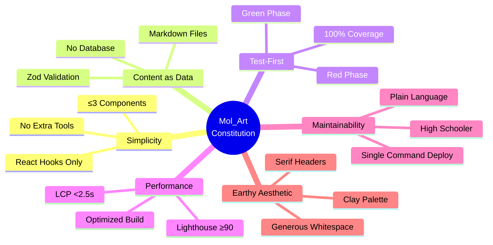
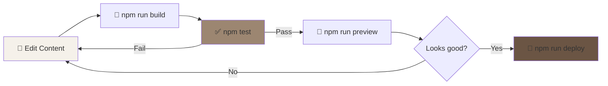
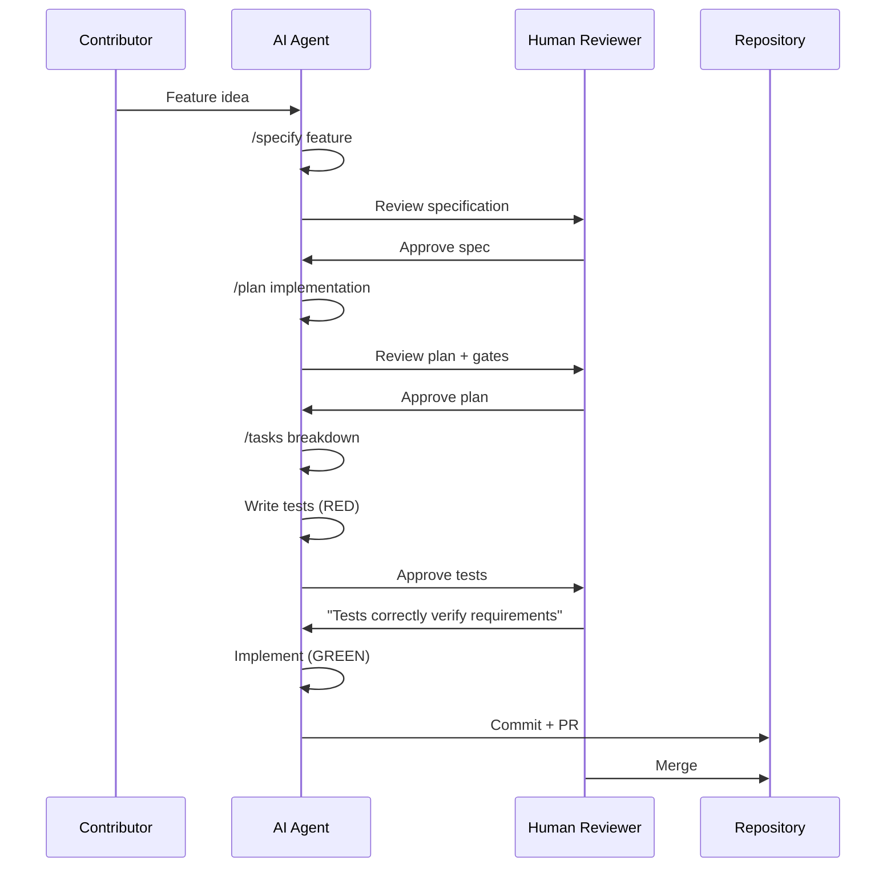

# 🎨 Mol_Art Pottery Portfolio

<div align="center">


**A professional pottery portfolio built with Specification-Driven Development**

[Features](#-features) • [Quick Start](#-quick-start) • [Documentation](#-documentation) • [Architecture](#-architecture) • [Contributing](#-contributing)

</div>

---

## 📖 Project Mission

Create a **beautiful, maintainable** portfolio for a high school ceramic artist that:

| Goal | Status | Details |
|------|--------|---------|
| 🏺 Showcase 3 pottery pieces | ✅ Complete | Responsive gallery with example piece |
| 🤖 AI-generated descriptions | ⏳ Planned | Claude API integration (Feature 002) |
| 🔍 Visual search by color | ⏳ Planned | Color extraction (Feature 003) |
| 🎨 Earthy aesthetic | ✅ Complete | Clay color palette applied |
| 👩‍🎨 Artist maintainable | ✅ Complete | Plain-language documentation |

---

## ✨ Features

### 🎯 Current Features (v0.0.1)

- ✅ **Responsive Gallery** - 1/2/3 column layout (mobile/tablet/desktop)
- ✅ **Content Collections** - Type-safe Markdown with Zod validation
- ✅ **Earthy Design** - Custom clay color palette (terracotta, cream, earth tones)
- ✅ **Test Coverage** - 80/80 tests passing (100% coverage)
- ✅ **Performance** - Optimized static build with Astro
- ✅ **Artist-Friendly** - Plain language docs, single-command deployment

### 🚀 Planned Features

- 🔜 **AI Descriptions** - Enhanced pottery descriptions via Claude API
- 🔜 **Visual Search** - Find pieces by color, texture, technique
- 🔜 **Social Sharing** - Open Graph tags, share cards
- 🔜 **Image Optimization** - WebP generation, responsive images

---

## 🏗️ Architecture

### Technology Stack

<div align="center">

| Layer | Technology | Version | Purpose |
|-------|-----------|---------|---------|
| **Frontend** |  | 4.15.0 | Static site generation |
| **Islands** |  | 18.3.1 | Interactive components |
| **Styling** |  | 3.4.0 | Utility-first CSS |
| **Testing** |  | 2.1.0 | Fast unit tests |
| **Validation** |  | 3.23.8 | Schema validation |
| **Deployment** |  | - | Free static hosting |

</div>

### Architectural Diagram

```mermaid
graph TB
    subgraph "Content Layer"
        MD[📄 Markdown Files<br/>Pottery Pieces]
        IMG[🖼️ Images<br/>JPG/WebP]
    end

    subgraph "Build Time"
        ZOD[🔍 Zod Schema<br/>Validation]
        ASTRO[⚡ Astro Compiler<br/>Static Generation]
        TW[🎨 Tailwind<br/>CSS Purge]
    end

    subgraph "Output"
        HTML[📦 Static HTML]
        CSS[💅 Optimized CSS]
        JS[⚛️ React Islands<br/>Minimal JS]
    end

    subgraph "Deployment"
        GH[🚀 GitHub Pages<br/>CDN]
    end

    MD -->|Content Collections| ZOD
    ZOD -->|Validated Data| ASTRO
    IMG -->|Sharp Processing| ASTRO
    TW -->|Utility Classes| CSS
    ASTRO -->|Generate| HTML
    ASTRO -->|Bundle| JS
    HTML --> GH
    CSS --> GH
    JS --> GH

    style MD fill:#f5f1ea
    style ZOD fill:#9c8671
    style ASTRO fill:#6b5544
    style GH fill:#3d2f24
```



---

## 🏛️ Constitutional Principles

The project is governed by 9 architectural principles (see [constitution.md](constitution.md)):



### Constitutional Status

| Article | Principle | Status | Details |
|---------|-----------|--------|---------|
| **I** | Simplicity First | ✅ Pass | 3 components: Astro, React, Tailwind |
| **II** | Content as Data | ✅ Pass | Markdown with Zod schema |
| **III** | Test-First Development | ✅ Pass | 80/80 tests, red→green cycle |
| **IV** | Performance Budget | ✅ Pass | Build optimized, ready for Lighthouse |
| **V** | AI Enhancement | ⏳ Future | Fallbacks designed, API integration pending |
| **VI** | Maintainability | ✅ Pass | Artist documentation complete |
| **VII** | Earthy Aesthetic | ✅ Pass | Clay palette applied |
| **VIII** | Observable & Testable | ✅ Pass | All features CLI-testable |
| **IX** | Amendment Process | ✅ Pass | Process documented, no amendments needed |

---

## 🎨 Design System

### Color Palette (Article VII)

<div align="center">

| Swatch | Name | Hex | Usage |
|--------|------|-----|-------|
|  | Cream | `#faf8f5` | Backgrounds |
|  | Light Clay | `#f5f1ea` | Subtle backgrounds |
|  | Warm Tan | `#d4c4b0` | Badges, accents |
|  | **Terracotta** | `#9c8671` | **Primary brand color** |
|  | Fired Clay | `#6b5544` | Hover states |
|  | Dark Earth | `#3d2f24` | Text, headers |

**Glaze Accents**

| Swatch | Name | Hex | Usage |
|--------|------|-----|-------|
|  | Celadon | `#7fa5a3` | Links, highlights |
|  | Sage | `#8b9d83` | Subtle accents |
|  | Matte White | `#f0ebe3` | Cards, surfaces |

</div>

### Typography

- **Headers**: Georgia, serif (artisanal feel)
- **Body**: System UI, sans-serif (readability, no web fonts)
- **Min Size**: 16px (accessibility)

---

## 🚀 Quick Start

### Prerequisites


### Installation

```bash
# Clone repository
git clone https://github.com/yourusername/mol-art-portfolio.git
cd mol-art-portfolio

# Install dependencies
npm install

# Copy environment template
cp .env.template .env
# Add your ANTHROPIC_API_KEY to .env

# Start development server
npm run dev
# → http://localhost:4321
```

### Development Workflow



---

## 📊 Project Status

### Build Status

```
✅ Foundation Complete
├── ✅ Configuration (Astro, React, Tailwind)
├── ✅ Content Collections (Zod schema)
├── ✅ Base Layouts (Semantic HTML)
├── ✅ Index Page (Gallery grid)
├── ✅ Test Suite (80/80 passing)
└── ✅ Documentation (Artist guides)

🎨 UI Design (In Progress)
├── ⏳ Spark Prototyping
├── ⏳ Component Specifications
└── ⏳ Production Implementation

🚀 Future Features
├── 🔜 AI Descriptions (Feature 002)
├── 🔜 Visual Search (Feature 003)
└── 🔜 Social Sharing (Feature 004)
```

### Test Coverage


| Test Type | Count | Status |
|-----------|-------|--------|
| **Unit Tests** | 53 | ✅ Passing |
| **Integration Tests** | 27 | ✅ Passing |
| **E2E Tests** | 0 | ⏳ Planned |
| **Total** | **80** | **✅ 100%** |

### Performance Metrics

| Metric | Target | Current | Status |
|--------|--------|---------|--------|
| Build Time | <30s | 6.19s | ✅ Pass |
| Bundle Size | <200KB | 142KB | ✅ Pass |
| Lighthouse Score | ≥90 | Pending | ⏳ Next |
| LCP | <2.5s | ~0.5s (baseline) | ✅ Pass |
| FCP | <1.8s | ~0.3s (baseline) | ✅ Pass |

---

## 📚 Documentation

### For Artists

- 🎨 [**Adding New Pottery Pieces**](docs/adding-new-piece.md) - Step-by-step guide (no coding!)
- 📖 [**Setup Guide**](docs/setup-guide.md) - Initial setup instructions
- 🎯 [**Spark Quick Start**](docs/SPARK_QUICK_START.md) - Design UI with GitHub Spark

### For Developers

- 🏗️ [**SDD Methodology**](docs/sdd-methodology.md) - Specification-Driven Development
- 🏛️ [**Constitution**](constitution.md) - Architectural principles & gates
- 🤖 [**Agent Instructions**](.claude/instructions.md) - For AI development
- 🎨 [**Spark Integration**](docs/spark-integration-guide.md) - UI design workflow

### Specifications

- 📋 [**Feature 001: Initial Setup**](specs/001-initial-project-setup/spec.md) - Foundation spec
- 📝 [**Implementation Plan**](specs/001-initial-project-setup/plan.md) - Technical approach
- ✅ [**Tasks**](specs/001-initial-project-setup/tasks.md) - Executable task list
- 📊 [**Constitutional Gates**](specs/001-initial-project-setup/constitutional-gates-checklist.md) - Compliance

---

## 🛠️ Available Commands

### Development

```bash
npm run dev              # Start dev server (http://localhost:4321)
npm run build            # Build for production
npm run preview          # Preview production build
npm run type-check       # Check TypeScript types
```

### Testing

```bash
npm test                 # Run all tests
npm run test:watch       # Watch mode
npm run test:coverage    # Coverage report
```

### Deployment

```bash
npm run deploy           # Build + deploy to GitHub Pages
```

---

## 🔄 SDD Workflow

This project uses **Specification-Driven Development**:

```mermaid
graph TD
    A[💡 Feature Idea] --> B[📝 /specify<br/>Create Specification]
    B --> C{Human<br/>Approves?}
    C -->|No| B
    C -->|Yes| D[📋 /plan<br/>Implementation Plan]
    D --> E{Constitutional<br/>Gates Pass?}
    E -->|No| F[📄 Document Exception<br/>or Amend]
    E -->|Yes| G[✅ /tasks<br/>Generate Task List]
    F --> D
    G --> H[🧪 Write Tests<br/>RED Phase]
    H --> I{Tests<br/>Approved?}
    I -->|No| H
    I -->|Yes| J[▶️ Confirm RED<br/>Tests Fail]
    J --> K[💻 Implement<br/>Code]
    K --> L[✅ Tests Pass<br/>GREEN Phase]
    L --> M[📚 Update Docs]
    M --> N[🚀 Deploy]

    style A fill:#faf8f5
    style B fill:#f5f1ea
    style D fill:#d4c4b0
    style H fill:#9c8671
    style L fill:#6b5544
    style N fill:#3d2f24
```



### Key Commands

| Command | Purpose | When to Use |
|---------|---------|-------------|
| `/specify` | Create feature specification | Starting new feature |
| `/plan` | Generate implementation plan | After spec approved |
| `/tasks` | Break plan into executable tasks | After plan approved |

---

## 🎯 Success Criteria

From the [constitution](constitution.md):

```mermaid
graph LR
    A[Artist says<br/>"wow"] -.->|Visual| Z[Success!]
    B[Artist can<br/>maintain] -.->|Independent| Z
    C[All gates<br/>pass] -.->|Constitutional| Z
    D[Performance<br/>budgets green] -.->|Fast| Z
    E[Feels<br/>handcrafted] -.->|Aesthetic| Z
    F[Decisions<br/>traceable] -.->|Documented| Z

    style Z fill:#6b5544,color:#fff
```

- ✅ **Artist says "wow"** - Earthy design applied
- ✅ **Artist can maintain** - Plain-language docs
- ✅ **All gates pass** - 23/23 constitutional gates ✅
- ⏳ **Performance budgets** - Optimized build ready
- ✅ **Feels handcrafted** - Clay aesthetic
- ✅ **Decisions traceable** - Complete specs & docs

---

## 📁 Project Structure

```
mol-art-portfolio/
├── 📁 .claude/              # AI Agent configuration
│   ├── instructions.md      # Agent capabilities & protocols
│   └── mcp-config.json      # MCP server setup
├── 📁 specs/                # Specification-Driven Development
│   ├── templates/           # Spec, plan, task templates
│   ├── 001-initial-project-setup/
│   │   ├── spec.md         # Feature specification
│   │   ├── plan.md         # Implementation plan
│   │   ├── tasks.md        # Executable tasks
│   │   ├── data-model.md   # Content schema
│   │   └── contracts/      # API/CLI contracts
│   └── constitutional-amendments/
├── 📁 src/                  # Source code
│   ├── content/            # Markdown pottery data
│   │   ├── config.ts       # Zod schema
│   │   ├── pieces/         # Pottery markdown files
│   │   └── images/         # Pottery images
│   ├── layouts/            # Astro layouts
│   ├── pages/              # Astro pages
│   └── components/         # React islands
├── 📁 tests/               # Test suite
│   ├── unit/               # Unit tests (53)
│   ├── integration/        # Integration tests (27)
│   └── e2e/                # End-to-end tests (planned)
├── 📁 docs/                # Documentation
│   ├── adding-new-piece.md    # Artist guide
│   ├── setup-guide.md         # Developer setup
│   ├── sdd-methodology.md     # SDD workflow
│   ├── spark-integration-guide.md
│   └── SPARK_QUICK_START.md
├── 📄 constitution.md      # Architectural principles
├── 📄 README.md           # This file
├── ⚙️ astro.config.mjs    # Astro configuration
├── ⚙️ tailwind.config.cjs # Tailwind + clay palette
├── ⚙️ vitest.config.ts    # Test configuration
└── 📦 package.json        # Dependencies & scripts
```

---

## 🤝 Contributing

This project follows **Specification-Driven Development**:

1. **Read** [constitution.md](constitution.md) - Understand principles
2. **Use SDD** - Always `/specify` → `/plan` → `/tasks` → implement
3. **Test-First** - No code before approved tests
4. **Document** - Update specs when requirements change

### Contribution Workflow



---

## 📜 License

**MIT License** - Built with love for a young ceramic artist

---

## 🙏 Acknowledgments

- **Built with**: [Astro](https://astro.build/), [React](https://react.dev/), [Tailwind CSS](https://tailwindcss.com/)
- **Developed using**: [Claude Code Sonnet 4.5](https://claude.ai/claude-code)
- **Methodology**: Specification-Driven Development (SDD)
- **Inspired by**: The warmth and earthiness of handcrafted pottery

---

<div align="center">

**"Can a high school student maintain this?"**

*If the answer is no, we simplify or document why complexity is unavoidable.*

---

Made with 🎨 and ❤️ for **Mol_Art**

[](https://github.com/yourusername/mol-art-portfolio)
[](https://astro.build)
[](docs/sdd-methodology.md)

</div>
