# The Mol_Art Constitution

*Architectural principles governing the Mol_Art pottery portfolio project*


---

## Preamble

This constitution establishes the architectural principles for building a professional pottery portfolio website that prioritizes **simplicity**, **maintainability**, and **clarity** above all else. Every decision must serve the ultimate goal: **a high school ceramic artist can maintain this independently**.

```mermaid
mindmap
  root((Mol_Art<br/>Constitution))
    Core_Mission[🎯 Core Mission]
      High_Schooler[High schooler<br/>can maintain]
      Simple[Maximum<br/>simplicity]
      Clear[Crystal<br/>clarity]
    Principles[📜 9 Articles]
      I[I: Simplicity<br/>≤3 components]
      II[II: Content as Data<br/>Markdown only]
      III[III: Test-First<br/>Always]
      IV[IV: Performance<br/>≥90 score]
      V[V: AI Enhancement<br/>Progressive]
      VI[VI: Maintainability<br/>Plain language]
      VII[VII: Earthy Aesthetic<br/>Clay palette]
      VIII[VIII: Observable<br/>CLI testable]
      IX[IX: Amendments<br/>Documented]
    Enforcement[⚖️ Enforcement]
      AI[AI Agent<br/>flags violations]
      Tests[Tests<br/>automated checks]
      Human[Human<br/>final authority]
```



---

## Article I: Simplicity First

**Principle**: Maximum 3 core components. Period.

### Approved Stack
1. **Astro** - Static site generation
2. **React** - Interactive islands only
3. **Tailwind CSS** - Styling

### Simplicity Gate (Enforced at Phase -1)

Before any implementation begins, these questions must be answered:

- [ ] Using ≤3 core components?
- [ ] Zero additional build tools beyond Astro's defaults?
- [ ] No state management libraries (use React hooks only)?

**If NO to any**: Create `specs/[feature]/complexity-tracking.md` documenting:
- Why the complexity is unavoidable
- What simpler alternatives were tried and why they failed
- How this serves the "maintainable by high schooler" principle

### Violation Protocol

Implementation **halts immediately** until complexity justification is approved by human.

### Examples

✅ **Allowed**:
- Using React hooks for local state
- Using Astro's built-in content collections
- Using Tailwind utility classes

❌ **Forbidden** (without justification):
- Adding Redux, Zustand, or other state libraries
- Adding additional frameworks (Vue, Svelte, etc.)
- Adding component libraries with runtime overhead

---

## Article II: Content as Data

**Principle**: All pottery pieces stored as markdown files with frontmatter. No database.

### Required File Structure

```
content/
  pieces/
    piece-01-earth-vessel.md
    piece-02-spiral-form.md
    piece-03-textured-bowl.md
  images/
    piece-01/
      main.jpg
      detail-01.jpg
      detail-02.jpg
```

### Frontmatter Schema

This schema is validated in tests and must be followed:

```yaml
---
title: "Earth Vessel"
date: "2025-03-15"
techniques: ["hand-building", "slip decoration"]
colors: ["terracotta", "cream", "rust"]
textures: ["rough", "organic"]
description: "Hand-built vessel..." # fallback if AI fails
aiDescription: "" # generated, not required
featured: true
---
```

### Content Gate (Enforced at Phase 2)

- [ ] Schema validation test exists and passes?
- [ ] Example markdown files created with real content?
- [ ] Artist can add new piece without touching code?

**Test Method**: Give artist markdown template, watch them create file successfully.

### Rationale

- **No database** = No server required = GitHub Pages deployment works
- **Markdown** = Artist knows this from school
- **Frontmatter** = Structured data without SQL
- **Version controlled** = Every change tracked in git

---

## Article III: Test-First Development

**Principle**: No production code before tests. No exceptions.

### Enforcement Protocol

1. Specification defines acceptance criteria
2. Tests written to verify criteria
3. **STOP**: User reviews and approves tests
4. Tests execute and **FAIL** (red phase confirmed)
5. Implementation begins

### Test Approval Checkpoint

The human must explicitly state:

> "These tests correctly verify the requirements."

Without this approval, **no implementation code shall be written**.

### Test Coverage Requirements

Every feature must have tests for:

- **Content parsing**: Markdown → structured data
- **Image optimization**: Before/after file sizes
- **AI description generation**: Mock Claude API responses
- **Visual search**: Color extraction accuracy
- **Build process**: All pages generated correctly

### Test Structure

```
tests/
  unit/                    # Individual functions
    content-parser.test.ts
    color-extractor.test.ts
  integration/            # Feature interactions
    gallery-page.test.ts
    ai-descriptions.test.ts
  e2e/                    # Full user flows
    add-pottery-piece.test.ts
```

### Violation Examples

❌ **Forbidden**:
- Writing implementation before tests
- Skipping test approval step
- Marking tests as "TODO" and implementing anyway
- Testing only happy paths

✅ **Required**:
- Red → Green → Refactor cycle
- Edge case testing
- Error condition testing
- Human approval before green phase

---

## Article IV: Performance Budget

**Principle**: Automated Lighthouse CI enforced in GitHub Actions.

### Required Metrics

| Metric | Threshold |
|--------|-----------|
| Performance Score | ≥90 |
| Largest Contentful Paint (LCP) | <2.5s |
| First Contentful Paint (FCP) | <1.8s |
| Total Blocking Time (TBT) | <200ms |
| Cumulative Layout Shift (CLS) | <0.1 |

### Performance Gate (Enforced at Phase 3: Deployment)

- [ ] Lighthouse CI configured in `.github/workflows/`?
- [ ] All budgets passing in CI?
- [ ] Performance regression alerts active?
- [ ] Images optimized with Sharp (webp + fallbacks)?

### Enforcement

GitHub Actions runs Lighthouse on every PR. **Merge blocked** if budgets fail.

### Optimization Requirements

- **Images**: Sharp processing with webp format + JPEG fallback
- **Lazy loading**: Images below fold use native lazy loading
- **Font loading**: System fonts only (no web font downloads)
- **JavaScript**: Islands architecture (minimal hydration)
- **CSS**: Purged Tailwind (unused classes removed)

---

## Article V: AI Features as Progressive Enhancement

**Principle**: AI-generated descriptions are **required features**, but the site must work if they fail.

### Implementation Requirements

1. Manual description in frontmatter is **always present**
2. AI description generation happens **at build time**
3. If AI generation fails, **fallback to manual description**
4. **No runtime API calls** (performance/cost constraint)

### AI Feature Gate (Enforced at Phase 2)

- [ ] Manual descriptions exist for all pieces?
- [ ] Build succeeds with AI API offline?
- [ ] Fallback behavior tested?
- [ ] AI generation documented in build logs?

### Build-Time AI Process

```bash
# During build
npm run build
  → Read content/pieces/*.md
  → Extract manual descriptions
  → Call Claude API for enhanced descriptions
  → If API fails: Use manual description
  → Generate static pages
```

### Error Handling

```javascript
// Example fallback logic
async function getDescription(piece) {
  try {
    const aiDescription = await generateAIDescription(piece);
    return aiDescription;
  } catch (error) {
    console.warn(`AI generation failed for ${piece.title}, using manual description`);
    return piece.description; // Always exists
  }
}
```

---

## Article VI: Maintainability for High Schooler

**Principle**: Code must be simple enough for artist to maintain independently.

### Maintainability Gates (Enforced at Phase 4: Documentation)

- [ ] README has "Adding New Pottery" section?
- [ ] Markdown template provided?
- [ ] Single-command deployment documented?
- [ ] Error messages written in plain language?
- [ ] No jargon in user-facing docs?

### User Testing Protocol

Create `docs/adding-new-piece.md` walkthrough. Before final deployment:

1. Artist attempts to add a piece using **only this documentation**
2. Observer watches but does not help
3. Count questions asked
4. Note confusion points

**Pass criteria**: Zero questions, successful deployment.

**Fail criteria**: Any clarifying questions → docs are incomplete → fix and retest.

### Plain Language Requirement

❌ **Jargon**:
> "Execute `npm run build` to invoke the Astro SSG pipeline and hydrate React islands."

✅ **Plain Language**:
> "Run `npm run build` to create your website files."

---

## Article VII: Earthy Aesthetic Principles

**Principle**: Design reflects handcrafted ceramic aesthetic through systematic constraints.

### Color Palette

Defined in `tailwind.config.js`:

```javascript
colors: {
  clay: {
    50: '#faf8f5',   // cream
    100: '#f5f1ea',  // light clay
    300: '#d4c4b0',  // warm tan
    500: '#9c8671',  // terracotta
    700: '#6b5544',  // fired clay
    900: '#3d2f24',  // dark earth
  },
  glaze: {
    blue: '#7fa5a3',   // celadon
    green: '#8b9d83',  // sage
    cream: '#f0ebe3',  // matte white
  }
}
```

#### Visual Palette

| Color | Swatch | Hex | Usage |
|-------|--------|-----|-------|
| Cream |  | `#faf8f5` | Backgrounds |
| Light Clay |  | `#f5f1ea` | Cards |
| Warm Tan |  | `#d4c4b0` | Borders |
| Terracotta |  | `#9c8671` | Brand primary |
| Fired Clay |  | `#6b5544` | Headings |
| Dark Earth |  | `#3d2f24` | Text |
| Celadon |  | `#7fa5a3` | Accents |
| Sage |  | `#8b9d83` | Secondary |
| Matte White |  | `#f0ebe3` | Highlights |

### Typography Scale

- **Headers**: Serif font (Georgia or similar) for artisanal feel
- **Body**: Sans-serif (system fonts) for readability
- **Minimum font size**: 16px (accessibility)

### Aesthetic Gate (Enforced at Phase 1: Design)

- [ ] Color palette matches clay/glaze tones?
- [ ] Touch targets ≥44px (mobile-friendly)?
- [ ] Whitespace breathes (min 2rem between sections)?
- [ ] Typography scales smoothly on mobile?

### Design Principles

- **Organic shapes**: Rounded corners (8px+)
- **Texture**: Subtle gradients mimicking clay
- **Whitespace**: Generous spacing (pottery needs room to breathe)
- **Hierarchy**: Clear visual flow from hero to details

---

## Article VIII: Observable and Testable

**Principle**: Every feature must be verifiable without opening a browser.

### Required CLI Commands

```bash
# Validate content
npm run validate-content

# Generate AI descriptions (dry-run)
npm run generate-descriptions --dry-run

# Test visual search
npm run search-by-color "#9c8671"

# Build and show output
npm run build --verbose

# Performance check
npm run perf-check
```

### Observability Gate (Enforced at Phase 2)

- [ ] Each feature has corresponding CLI command?
- [ ] CLI outputs include success/failure states?
- [ ] Logs show what happened, not just "done"?
- [ ] Artist can test without deploying?

### Example Output

✅ **Good Observable Output**:
```
🎨 Validating content...
  ✓ piece-01-earth-vessel.md - Valid
  ✓ piece-02-spiral-form.md - Valid
  ✗ piece-03-textured-bowl.md - Missing 'techniques' field

1 error found. Fix and run again.
```

❌ **Bad Output**:
```
Done.
```

---

## Article IX: Constitutional Amendments

**Principle**: Principles can evolve, but changes require documentation.

### Amendment Process

1. Create `specs/constitutional-amendments/[YYYY-MM-DD]-[title].md`
2. Document **why principle failed**
3. Propose alternative with **rationale**
4. Demonstrate it maintains **"high schooler maintainability"**
5. Assess **backwards compatibility** or migration path
6. Get **explicit approval** before proceeding

### Amendment Template

```markdown
# Amendment: [Title]

## Date
YYYY-MM-DD

## Article Affected
[Article number and title]

## Why Current Principle Failed
[Specific scenario where principle couldn't be followed]

## Simpler Alternatives Tried
1. [Alternative 1]: [Why it failed]
2. [Alternative 2]: [Why it failed]

## Proposed Change
[New principle or exception]

## Maintainability Impact
[How does this affect "high schooler can maintain"?]

## Backwards Compatibility
[Breaking changes? Migration path?]

## Approval
- [ ] Human approves this amendment
```

### Example Amendment

```markdown
# Amendment: Adding Component Library (2025-10-04)

## Article Affected
Article I: Simplicity First

## Why Current Principle Failed
Manual Tailwind styling became unmaintainable across 15+ components.
Repeated patterns led to 200+ character className strings.

## Simpler Alternatives Tried
1. Utility classes only: Led to unmaintainable className bloat
2. CSS modules: Added build complexity and learning curve

## Proposed Change
Add shadcn/ui (headless components, no bundle bloat, copy-paste model).
This adds a 4th component but improves maintainability.

## Maintainability Impact
✅ Components have semantic names: <Card>, <Button>
✅ Artist recognizes HTML patterns
✅ Less copy-paste errors

## Backwards Compatibility
Existing Tailwind utilities unchanged.
Migration: 2 hours, low risk.

## Approval
- [x] Human approves this amendment
```

---

## Enforcement & Accountability

### Who Enforces These Principles?

1. **AI Agent** (primary enforcer)
   - Flags violations before implementation
   - Documents exceptions
   - Updates specs when changes occur

2. **Tests** (automated enforcement)
   - Content schema validation
   - Performance budgets
   - Build process verification

3. **Human** (final authority)
   - Approves specifications
   - Approves tests
   - Approves amendments

### Violation Response Protocol

```mermaid
flowchart TD
    A[🚨 Violation Detected] --> B[⏸️ Stop Immediately]
    B --> C[📝 Document Violation<br/>in spec]
    C --> D{Solution<br/>Type?}
    D -->|Conform| E[✅ Propose<br/>Conforming Solution]
    D -->|Amend| F[📋 Propose<br/>Amendment]
    E --> G[Wait for<br/>Human Approval]
    F --> G
    G --> H{Approved?}
    H -->|Yes| I[✅ Proceed with<br/>Approved Solution]
    H -->|No| C
    I --> J[Update<br/>Documentation]
    J --> K[Resume<br/>Implementation]

    style A fill:#ff6b6b,color:#fff
    style B fill:#ffcccc
    style E fill:#ccffcc
    style F fill:#fff3cd
    style I fill:#9c8671,color:#fff
    style K fill:#7fa5a3,color:#fff
```



When a violation is detected:

1. **Stop immediately**
2. **Document the violation** in spec
3. **Propose solution**:
   - Conform to principle, OR
   - Amend constitution with justification
4. **Wait for approval**
5. **Proceed only after approval**

---

## Living Document

This constitution is a **living document**. It will evolve as we learn what works and what doesn't. But every evolution must be:

- **Documented** (amendment process)
- **Justified** (why change was needed)
- **Aligned** with core mission (maintainable by artist)

**Core mission never changes**: Build something the artist can maintain herself.

---

## Article Relationships

```mermaid
graph TB
    subgraph Foundation[" 🏛️ Foundation Articles "]
        I[I: Simplicity<br/>≤3 components]
        II[II: Content as Data<br/>Markdown]
        III[III: Test-First<br/>Red-Green-Refactor]
    end

    subgraph Quality[" ✨ Quality Articles "]
        IV[IV: Performance<br/>≥90 Lighthouse]
        VII[VII: Earthy Aesthetic<br/>Clay palette]
    end

    subgraph Intelligence[" 🤖 AI Articles "]
        V[V: AI Enhancement<br/>Build-time only]
    end

    subgraph Maintenance[" 🔧 Maintenance Articles "]
        VI[VI: Maintainability<br/>High schooler]
        VIII[VIII: Observable<br/>CLI testable]
    end

    subgraph Governance[" 📋 Governance "]
        IX[IX: Amendments<br/>Documented changes]
    end

    I --> IV
    I --> V
    II --> V
    III --> VI
    VII --> IV
    VIII --> VI

    Foundation --> Quality
    Foundation --> Intelligence
    Foundation --> Maintenance
    Maintenance --> Governance

    style I fill:#9c8671,color:#fff
    style II fill:#9c8671,color:#fff
    style III fill:#9c8671,color:#fff
    style IV fill:#7fa5a3,color:#fff
    style VII fill:#7fa5a3,color:#fff
    style V fill:#8b9d83,color:#fff
    style VI fill:#d4c4b0
    style VIII fill:#d4c4b0
    style IX fill:#f5f1ea
```



## Quick Reference

| Article | Principle | Gate Phase | Status |
|---------|-----------|------------|--------|
| I | Simplicity First (≤3 components) | Phase -1 | ✅ Passing |
| II | Content as Data (markdown) | Phase 2 | ✅ Passing |
| III | Test-First Development | All phases | ✅ Passing |
| IV | Performance Budget (≥90) | Phase 3 | ⏳ Pending |
| V | AI Progressive Enhancement | Phase 2 | 🔄 Future |
| VI | High Schooler Maintainability | Phase 4 | ✅ Passing |
| VII | Earthy Aesthetic | Phase 1 | ✅ Passing |
| VIII | Observable & Testable (CLI) | Phase 2 | ✅ Passing |
| IX | Amendment Process | As needed | ✅ Active |

---

**Remember**: Every line of code, every dependency, every feature must answer:

> "Can a high school student maintain this?"

If the answer is no, simplify or document why complexity is unavoidable.
