# Specification-Driven Development (SDD) Methodology

*How we build the Mol_Art pottery portfolio*

---

## What is SDD?

**Specification-Driven Development** is a methodology where every feature begins with a detailed specification that defines:
- **What** needs to be built (user stories)
- **How** we know it works (acceptance criteria)
- **Why** it matters (rationale)

Only after the specification is approved do we move to planning, then tests, then implementation.

**Core Principle**: The specification is the source of truth. Code implements the spec, not the other way around.

---

## The SDD Workflow

```mermaid
flowchart TD
    A[💡 /specify<br/>Define Feature] --> B{Human<br/>Approves?}
    B -->|Yes| C[📋 /plan<br/>Implementation Strategy]
    B -->|No| A
    C --> D{Human<br/>Approves?}
    D -->|Yes| E[✅ /tasks<br/>Break into Steps]
    D -->|No| C
    E --> F[🔴 Write Tests<br/>RED Phase]
    F --> G{Tests<br/>Approved?}
    G -->|Yes| H[✅ Confirm Red<br/>Tests Fail]
    G -->|No| F
    H --> I[💚 Implement<br/>GREEN Phase]
    I --> J{Tests<br/>Pass?}
    J -->|Yes| K[📝 Document]
    J -->|No| I
    K --> L[🚀 Deploy]

    style A fill:#f9f7f4
    style C fill:#f9f7f4
    style E fill:#f9f7f4
    style F fill:#ffcccc
    style H fill:#ffcccc
    style I fill:#ccffcc
    style J fill:#ccffcc
    style K fill:#e3f0eb
    style L fill:#9c8671,color:#fff
```



---

## Phase 0: `/specify` - Feature Specification

### Purpose
Define **what** needs to be built before thinking about **how**.

### Process

1. **Agent creates specification**:
   - Scans `specs/` for next feature number (001, 002, etc.)
   - Creates git branch: `[number]-[feature-name]`
   - Generates `specs/[branch]/spec.md` from template
   - Populates with user stories and acceptance criteria

2. **Human reviews**:
   - Are user stories complete?
   - Are acceptance criteria testable?
   - Any ambiguities marked `[NEEDS CLARIFICATION]`?
   - Does it align with constitutional principles?

3. **Human approves**:
   - Explicitly states: **"Specification approved, proceed to planning"**
   - Agent moves to Phase 1

### Specification Template Structure

```markdown
# Feature: [Name]

## Overview
[Brief description of the feature]

## User Stories
As a [user type], I want [goal] so that [benefit]

## Acceptance Criteria
Given [context]
When [action]
Then [expected outcome]

## Non-Functional Requirements
- Performance: [specific metric]
- Accessibility: [WCAG level]
- Browser support: [list]

## Out of Scope
[What this feature explicitly does NOT include]

## Dependencies
[Other features this depends on]

## Risks
[Potential issues and mitigations]
```

### Example Specification

```markdown
# Feature: Gallery Page

## User Stories
1. As a visitor, I want to see all pottery pieces at once so I can browse the collection
2. As a visitor, I want to click a piece to see details
3. As a mobile user, I want the gallery to work beautifully on my phone

## Acceptance Criteria
- Gallery displays 3 pottery pieces
- Responsive layout: 1 column mobile, 2 tablet, 3 desktop
- Images lazy-load with blur-up placeholders
- Hover reveals piece title and techniques
- Click navigates to detail page

## Non-Functional Requirements
- Performance: LCP <2.5s, FCP <1.8s
- Accessibility: WCAG 2.1 AA
- Browser support: Last 2 versions of Chrome, Firefox, Safari, Edge
```

---

## Phase 1: `/plan` - Implementation Planning

### Purpose
Define **how** to implement the feature within constitutional constraints.

### Process

1. **Agent creates plan**:
   - Reads approved `spec.md`
   - Reads `constitution.md` for constraints
   - Researches technical options (web search)
   - Documents technology choices with rationale
   - Creates supporting documentation:
     - `plan.md` - High-level architecture
     - `data-model.md` - Content schemas
     - `contracts/` - API/CLI specifications
     - `research.md` - Library comparisons

2. **Constitutional Gates**:
   Agent runs checks against all 9 constitutional articles:

   ```markdown
   ### Simplicity Gate (Article I)
   - [ ] Using ≤3 core components?
   - [ ] Zero additional frameworks?

   ### Observability Gate (Article VIII)
   - [ ] CLI commands defined for all features?
   - [ ] Each feature testable without browser?

   ### Maintainability Gate (Article VI)
   - [ ] High schooler can understand?
   - [ ] Single-command deployment?
   ```

3. **Human reviews**:
   - All gates pass or justified exceptions?
   - Technology choices traced to requirements?
   - Plan stays high-level (details in separate files)?

4. **Human approves**:
   - States: **"Implementation plan approved, generate tasks"**
   - Agent moves to Phase 2

### Plan Structure

```markdown
# Implementation Plan: [Feature Name]

## Architecture Overview
[High-level approach]

## Technology Choices
- [Technology]: [Rationale linked to spec requirement]

## Phase Gates
### Phase -1: Pre-Implementation
- [Constitutional gate checks]

### Phase 1: Foundation
- [Setup tasks]

### Phase 2: Core Implementation
- [Main development tasks]

### Phase 3: Polish
- [Refinement tasks]

## Data Model
See: data-model.md

## Contracts
See: contracts/ directory

## Risks & Mitigations
- [Risk]: [How we'll handle it]
```

---

## Phase 2: `/tasks` - Task Generation

### Purpose
Break the plan into executable, trackable tasks.

### Process

1. **Agent generates tasks**:
   - Reads `plan.md`, `data-model.md`, `contracts/`
   - Derives specific tasks from plans
   - Marks parallelizable tasks with `[P]`
   - Defines dependencies between tasks
   - Groups into phases

2. **Task Format**:
   ```markdown
   ## Phase 0: Foundation
   - [P] Create Astro project structure
   - [P] Configure Tailwind with clay palette
   - [ ] Set up content collections (depends: project structure)

   ## Phase 1: Content System
   - [P] Write content parser tests
   - [P] Write validation tests
   - [ ] Implement content parser (depends: parser tests approved)
   ```

3. **Parallelization**:
   - `[P]` = Can run in parallel
   - No marker = Sequential dependency
   - Enables faster development

### Task Generation Rules

- **Granular**: Each task is 15-60 minutes of work
- **Testable**: Each task has clear success criteria
- **Ordered**: Dependent tasks clearly marked
- **Grouped**: Related tasks in same phase

---

## Phase 3: Test-First Implementation

### Purpose
Ensure every feature is tested before it's implemented.

### The Red-Green-Refactor Cycle

```mermaid
stateDiagram-v2
    [*] --> WriteTest: 🔴 RED Phase
    WriteTest --> RequestApproval
    RequestApproval --> WriteTest: Needs changes
    RequestApproval --> ConfirmRed: Approved
    ConfirmRed --> Implement: Tests fail ✓
    Implement --> RunTests: 💚 GREEN Phase
    RunTests --> Implement: Tests fail
    RunTests --> Refactor: Tests pass ✓
    Refactor --> [*]: Deploy

    note right of WriteTest
        Write failing tests
        that verify spec
    end note

    note right of ConfirmRed
        Verify tests actually
        fail before coding
    end note

    note right of Implement
        Write minimal code
        to pass tests
    end note
```



### Detailed Process

#### Step 1: Write Tests

```typescript
// content-parser.test.ts
describe('Content Parser', () => {
  it('parses pottery frontmatter correctly', () => {
    const markdown = `---
title: "Earth Vessel"
techniques: ["hand-building"]
colors: ["terracotta"]
---`;

    const result = parseContent(markdown);

    expect(result.title).toBe("Earth Vessel");
    expect(result.techniques).toContain("hand-building");
    expect(result.colors).toContain("terracotta");
  });

  it('throws error for missing required fields', () => {
    const markdown = `---
title: "Vessel"
---`; // Missing techniques

    expect(() => parseContent(markdown)).toThrow('Missing required field: techniques');
  });
});
```

#### Step 2: Request Approval

```
AGENT: "I've written tests for content parsing. They cover:
- ✓ Valid frontmatter parsing
- ✓ Required field validation
- ✓ Array field handling
- ✓ Error cases for malformed YAML

Do these tests correctly verify the requirements from spec.md?"
```

#### Step 3: Human Approves

```
HUMAN: "These tests correctly verify the requirements."
```

**Critical**: Without this explicit approval, agent does NOT proceed to implementation.

#### Step 4: Confirm Red Phase

```bash
npm test

# EXPECTED OUTPUT:
FAIL tests/content-parser.test.ts
  ✗ parses pottery frontmatter correctly
    ReferenceError: parseContent is not defined
```

This confirms we're starting from a failing state (red phase).

#### Step 5: Implement

```typescript
// content-parser.ts
import matter from 'gray-matter';

export function parseContent(markdown: string) {
  const { data } = matter(markdown);

  // Validate required fields
  const requiredFields = ['title', 'techniques', 'colors'];
  for (const field of requiredFields) {
    if (!(field in data)) {
      throw new Error(`Missing required field: ${field}`);
    }
  }

  return data;
}
```

#### Step 6: Confirm Green Phase

```bash
npm test

# EXPECTED OUTPUT:
PASS tests/content-parser.test.ts
  ✓ parses pottery frontmatter correctly (5ms)
  ✓ throws error for missing required fields (2ms)
```

All tests pass. Green phase achieved.

#### Step 7: Document

Update relevant docs:
- If implementation differs from plan → Update `plan.md`
- If user-facing behavior → Update `docs/`
- Commit with message linking to spec

---

## Constitutional Enforcement

### What Are Constitutional Gates?

Checkpoints that ensure every feature aligns with the 9 constitutional articles.

### When They Run

- **Phase -1** (before planning): Simplicity, Observability, Maintainability
- **Phase 1** (during planning): Content as Data, Earthy Aesthetic
- **Phase 2** (during implementation): Test-First, AI Enhancement
- **Phase 3** (before deployment): Performance Budget
- **Phase 4** (after deployment): Documentation Quality

### What Happens on Gate Failure?

1. **Agent stops immediately**
2. Agent documents the failure
3. Agent proposes:
   - **Alternative**: Conforming solution, OR
   - **Amendment**: Constitutional change with justification
4. Human decides which path to take
5. Only after approval does work resume

### Example: Simplicity Gate Failure

```
AGENT: "The visual search feature requires adding a color extraction library (vibrant.js),
which would be our 4th component. This violates Article I (max 3 components).

Options:

A. ALTERNATIVE: Implement basic color extraction in pure JavaScript
   - Pros: Stays within constitutional limits
   - Cons: Less accurate, more code to maintain

B. AMENDMENT: Allow vibrant.js as exception
   - Pros: Better accuracy, battle-tested library
   - Cons: Sets precedent for adding dependencies

I recommend Option A for constitutional compliance.

What would you like to do?"
```

---

## Spec Drift Detection & Correction

### What is Spec Drift?

When code and specs become out of sync:
- Code implements features not in spec
- Spec describes features not in code
- Implementation differs from plan

### How Agent Detects It

- Monitors file changes
- Compares code against specs
- Flags undocumented features
- Alerts on plan deviations

### Correction Protocol

```
AGENT: "Spec drift detected:

File: src/components/Gallery.tsx
Issue: Implements infinite scroll (not in spec.md)
Risk: Undocumented feature may break in future changes

Recommended action:
1. Update specs/001-gallery/spec.md with infinite scroll requirement
2. Add acceptance criteria for scroll behavior
3. Create tests for infinite scroll
4. Update plan.md if architectural impact

Should I proceed with spec update?"
```

Human approves, agent updates specs, drift resolved.

---

## Documentation Requirements

### For Every Feature

1. **Technical docs** (in `specs/[feature]/`)
   - spec.md
   - plan.md
   - data-model.md
   - contracts/

2. **User docs** (in `docs/`)
   - How feature works
   - How to use it
   - Troubleshooting common issues

### Documentation Quality Gate

Before feature is marked "complete":

1. **Simulate user**: Can artist use feature with only the docs?
2. **Test docs**: Give docs to artist, watch her try
3. **Count questions**: Zero questions = Pass, Any questions = Fail
4. **Fix confusion**: Update docs at exact point of confusion
5. **Retest**: Repeat until zero questions

---

## Benefits of SDD

### For the Project

- **Spec is truth**: Code always matches documented intent
- **Testable**: Every feature has tests before code
- **Maintainable**: Documentation stays current
- **Traceable**: Every decision links back to spec

### For the Artist

- **Understandable**: Clear docs explain what and why
- **Predictable**: Features work as documented
- **Maintainable**: She can modify without breaking
- **Confident**: Comprehensive tests catch issues

### For AI Agents

- **Clear goals**: Specs define exact requirements
- **Checkpoints**: Human approval at key phases
- **Guardrails**: Constitutional gates prevent mistakes
- **Accountability**: Specs document all decisions

---

## Common Pitfalls & Solutions

### Pitfall 1: Writing Code Before Tests

**Problem**: Tempting to "just quickly implement" before writing tests.

**Solution**: Agent enforces test-first protocol. No implementation without:
1. Tests written
2. Human approval
3. Red phase confirmed

### Pitfall 2: Skipping Specification

**Problem**: "I know what to build, let's just code it."

**Solution**: Specification creates shared understanding. Even "obvious" features need specs because:
- Documents why (not just what)
- Creates approval checkpoint
- Enables future modifications

### Pitfall 3: Ignoring Gates

**Problem**: "This gate doesn't apply to my feature."

**Solution**: All gates apply to all features. If gate seems irrelevant:
1. Document why in spec
2. Explicitly mark gate as N/A with justification
3. Get human approval

### Pitfall 4: Stale Documentation

**Problem**: Code changes but docs don't.

**Solution**: Agent detects spec drift and alerts. Every code change triggers doc review.

---

## Quick Reference

### Phase Progression

```mermaid
graph LR
    subgraph Phase_0[" Phase 0: Specify "]
        A1[📝 /specify] --> A2[spec.md]
        A2 --> A3{Approved?}
    end

    subgraph Phase_1[" Phase 1: Plan "]
        B1[📋 /plan] --> B2[plan.md]
        B2 --> B3[data-model.md]
        B3 --> B4[contracts/]
        B4 --> B5{Approved?}
    end

    subgraph Phase_2[" Phase 2: Tasks "]
        C1[✅ /tasks] --> C2[tasks.md]
        C2 --> C3[Auto-proceed]
    end

    subgraph Phase_3[" Phase 3: Implement "]
        D1[🔴 Tests] --> D2{Approved?}
        D2 --> D3[💚 Code]
        D3 --> D4[Deploy]
    end

    A3 -->|Yes| B1
    A3 -->|No| A1
    B5 -->|Yes| C1
    B5 -->|No| B1
    C3 --> D1

    style Phase_0 fill:#faf8f5
    style Phase_1 fill:#f5f1ea
    style Phase_2 fill:#d4c4b0
    style Phase_3 fill:#9c8671,color:#fff
```



| Phase | Command | Output | Approval Needed |
|-------|---------|--------|-----------------|
| 0 | `/specify` | spec.md | Yes |
| 1 | `/plan` | plan.md, data-model.md, contracts/ | Yes |
| 2 | `/tasks` | tasks.md | No (auto-proceed) |
| 3 | Test-first | Tests → Code | Yes (for tests) |

### Required Approvals

1. **Specification approval**: "Specification approved, proceed to planning"
2. **Plan approval**: "Implementation plan approved, generate tasks"
3. **Test approval**: "These tests correctly verify the requirements"
4. **Constitutional amendments**: Explicit approval for each amendment

### Constitutional Gates

```mermaid
mindmap
  root((Constitutional<br/>Gates))
    Phase_minus1[Phase -1: Pre-Implementation]
      I[I: Simplicity<br/>≤3 components]
      VIII[VIII: Observable<br/>CLI testable]
      VI[VI: Maintainability<br/>High schooler]
    Phase_1[Phase 1: Design]
      VII[VII: Aesthetic<br/>Earthy colors]
    Phase_2[Phase 2: Implementation]
      II[II: Content as Data<br/>Markdown]
      III[III: Test-First<br/>Red-Green]
      V[V: AI Enhancement<br/>Fallbacks]
    Phase_3[Phase 3: Deployment]
      IV[IV: Performance<br/>≥90 score]
    Phase_4[Phase 4: Documentation]
      VI_2[VI: Maintainability<br/>Plain language]
    Any_Phase[Any Phase]
      IX[IX: Amendments<br/>Process]
```



| Article | Check | Phase |
|---------|-------|-------|
| I | ≤3 components | -1 |
| II | Markdown content | 2 |
| III | Test-first | All |
| IV | Performance ≥90 | 3 |
| V | AI fallbacks | 2 |
| VI | High schooler can maintain | 4 |
| VII | Earthy aesthetic | 1 |
| VIII | CLI testable | 2 |
| IX | Amendment process | As needed |

---

## Summary

**SDD is about clarity, not bureaucracy.**

Every step serves the mission: Build something the artist can maintain herself.

- **Specifications** ensure we build the right thing
- **Plans** ensure we build it the right way
- **Tasks** ensure we build it efficiently
- **Tests** ensure it works correctly
- **Gates** ensure it stays simple
- **Documentation** ensures she can maintain it

**The result**: A portfolio as carefully crafted as her pottery.
