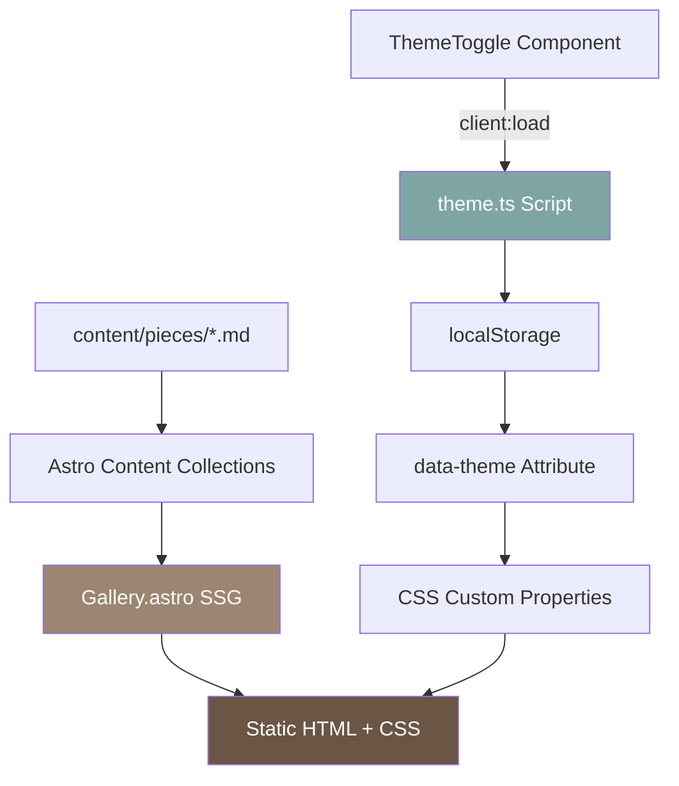

# Implementation Plan: Pottery Gallery with Global Theme

**Feature**: 002-gallery-with-theme
**Date**: 2025-10-05
**Status**: Planning Phase

---

## Architecture Overview

We'll implement a **hybrid architecture** combining Astro's static generation with minimal client-side interactivity:

1. **Static Gallery**: Astro component renders pottery grid server-side
2. **Global Theme System**: Vanilla JS + CSS custom properties for theme switching
3. **Content Integration**: Astro content collections provide pottery data
4. **Progressive Enhancement**: Works without JS, enhanced with theme toggle



---

## Technology Decisions

### Decision 1: Theme System Architecture

**Requirement**: Global site-wide theme with persistence and no FOUC

**Options Considered**:
1. Alpine.js (lightweight reactive framework)
2. Nano Stores (Astro-recommended state management)
3. Vanilla JS + CSS custom properties

**Selected**: **Vanilla JS + CSS custom properties**

**Rationale**:
- **Simplicity**: No additional framework (Article I compliance)
- **Performance**: Minimal runtime overhead (~1KB minified)
- **No FOUC**: Inline script in `<head>` applies theme before render
- **Maintainability**: High schooler can understand vanilla JS
- **No Build Step**: Pure JavaScript, no compilation needed

**Implementation**:
```typescript
// src/scripts/theme.ts
type Theme = 'light' | 'dark';

function getTheme(): Theme {
  return (localStorage.getItem('pottery-theme') as Theme) || 'light';
}

function setTheme(theme: Theme) {
  localStorage.setItem('pottery-theme', theme);
  document.documentElement.setAttribute('data-theme', theme);
}

function toggleTheme() {
  const current = getTheme();
  setTheme(current === 'light' ? 'dark' : 'light');
}

// Apply on page load (prevents FOUC)
setTheme(getTheme());

// Export for theme toggle component
window.toggleTheme = toggleTheme;
window.getTheme = getTheme;
```

**Constitutional Check**: ✅ Article I (no framework), ✅ Article VI (simple JS)

---

### Decision 2: Gallery Component Structure

**Requirement**: Responsive grid displaying pottery from content collections

**Options Considered**:
1. Single `Gallery.astro` component (all-in-one)
2. Separate `PotteryCard.astro` + `Gallery.astro` (modular)
3. React island for gallery (client-side rendering)

**Selected**: **Single Gallery.astro component**

**Rationale**:
- **Simplicity**: One file to maintain (Article I, VI)
- **Performance**: Fully server-side rendered, zero JS for gallery
- **Maintainability**: Artist doesn't need to understand component composition
- **SEO**: All content rendered at build time

**Trade-offs**:
- ❌ Slightly longer file (~200 lines)
- ✅ No prop drilling or component communication
- ✅ Easier to test as single unit

**Constitutional Check**: ✅ Article I (static component), ✅ Article VIII (testable via build)

---

### Decision 3: Theme Toggle Component

**Requirement**: Fixed-position toggle button on all pages

**Options Considered**:
1. Astro component with `client:load` directive
2. Web component (custom element)
3. Global navbar component

**Selected**: **Astro component with client:load**

**Rationale**:
- **Astro-native**: Uses framework's built-in hydration
- **Lazy Loading**: Only loads when visible
- **Simple**: Single component, easy to place in layout
- **No Framework**: Pure vanilla JS, no React needed

**Implementation**:
```astro
---
// src/components/ThemeToggle.astro
---
<button id="theme-toggle" class="theme-toggle">
  <svg id="sun-icon" class="icon"><!-- Sun SVG --></svg>
  <svg id="moon-icon" class="icon hidden"><!-- Moon SVG --></svg>
  <span id="theme-label">Dark</span>
</button>

<script>
  const button = document.getElementById('theme-toggle');
  const updateUI = () => {
    const theme = window.getTheme();
    const isDark = theme === 'dark';
    document.getElementById('sun-icon')?.classList.toggle('hidden', isDark);
    document.getElementById('moon-icon')?.classList.toggle('hidden', !isDark);
    const label = document.getElementById('theme-label');
    if (label) label.textContent = isDark ? 'Light' : 'Dark';
    button?.setAttribute('aria-pressed', String(isDark));
  };

  button?.addEventListener('click', () => {
    window.toggleTheme();
    updateUI();
  });

  updateUI();
</script>
```

**Constitutional Check**: ✅ Article I (no React needed), ✅ Article VIII (testable)

---

### Decision 4: CSS Architecture

**Requirement**: Theme-aware colors with smooth transitions

**Options Considered**:
1. Tailwind dark mode classes (`dark:bg-xyz`)
2. CSS custom properties with data-theme
3. Separate light/dark CSS files

**Selected**: **CSS custom properties with data-theme**

**Rationale**:
- **Flexibility**: Can add more themes easily
- **Performance**: No duplicate CSS, single transition rule
- **Maintainability**: All colors defined in one place
- **Tailwind Compatible**: Can use arbitrary values `bg-[var(--bg-primary)]`

**Implementation**:
```css
/* Base colors (light theme default) */
:root {
  --bg-page: #faf8f5;
  --bg-card: #ffffff;
  --text-title: #3d2f24;
  --text-body: #6b5544;
  --color-badge: #d4c4b0;
  --color-accent: #9c8671;
}

/* Dark theme */
[data-theme='dark'] {
  --bg-page: #1a1410;
  --bg-card: #2d2419;
  --text-title: #f5f1ea;
  --text-body: #d4c4b0;
  --color-badge: #3d2f24;
}

/* Global transition for theme changes */
* {
  transition: background-color 300ms, color 300ms, border-color 300ms;
}
```

**Constitutional Check**: ✅ Article VII (earthy colors), ✅ Article VI (simple CSS)

---

### Decision 5: Icons for Theme Toggle

**Requirement**: Sun/Moon icons for light/dark mode

**Options Considered**:
1. `astro-icon` package (adds dependency)
2. Lucide React icons (requires React)
3. Inline SVG (no dependencies)

**Selected**: **Inline SVG**

**Rationale**:
- **Zero Dependencies**: No package installation (Article I)
- **Performance**: Inlined, no HTTP request
- **Customizable**: Can adjust colors, sizes directly
- **Simple**: Copy-paste SVG from Lucide or Heroicons

**Implementation**:
```html
<!-- Sun Icon -->
<svg class="icon" width="20" height="20" viewBox="0 0 24 24" fill="none" stroke="currentColor">
  <circle cx="12" cy="12" r="5"/>
  <line x1="12" y1="1" x2="12" y2="3"/>
  <!-- ...more lines -->
</svg>

<!-- Moon Icon -->
<svg class="icon" width="20" height="20" viewBox="0 0 24 24" fill="none" stroke="currentColor">
  <path d="M21 12.79A9 9 0 1 1 11.21 3 7 7 0 0 0 21 12.79z"/>
</svg>
```

**Constitutional Check**: ✅ Article I (no framework)

---

### Decision 6: Animation Implementation

**Requirement**: Sequential fade-in, skeleton loaders, hover effects

**Options Considered**:
1. CSS animations (declarative)
2. Framer Motion (requires React)
3. GSAP (animation library)

**Selected**: **CSS animations + keyframes**

**Rationale**:
- **Performance**: GPU-accelerated transforms/opacity
- **No JavaScript**: Purely CSS (Article I)
- **Browser Support**: Excellent across all targets
- **Simple**: Artist can adjust timing values easily

**Implementation**:
```css
@keyframes fadeIn {
  from {
    opacity: 0;
    transform: translateY(20px);
  }
  to {
    opacity: 1;
    transform: translateY(0);
  }
}

.pottery-card {
  animation: fadeIn 0.6s ease-out forwards;
}

.pottery-card:nth-child(1) { animation-delay: 0ms; }
.pottery-card:nth-child(2) { animation-delay: 100ms; }
.pottery-card:nth-child(3) { animation-delay: 200ms; }
/* Generated for each card */

@keyframes shimmer {
  0% { background-position: -200% 0; }
  100% { background-position: 200% 0; }
}

.skeleton {
  background: linear-gradient(90deg, var(--skeleton-base) 0%, var(--skeleton-shine) 50%, var(--skeleton-base) 100%);
  background-size: 200% 100%;
  animation: shimmer 2s linear infinite;
}
```

**Constitutional Check**: ✅ Article I (no library), ✅ Article IV (performant)

---

### Decision 7: Content Collections Integration

**Requirement**: Gallery reads pottery from `content/pieces/`

**Already Decided**: Spec 001 established Zod schema

**Implementation**:
```typescript
---
// src/pages/gallery.astro
import { getCollection } from 'astro:content';

const pieces = await getCollection('pieces');
const sortedPieces = pieces.sort((a, b) =>
  b.data.date.getTime() - a.data.date.getTime()
);
---
```

**Constitutional Check**: ✅ Article II (content as data)

---

## Data Model

### Content Collections Schema (Already Defined)

From spec 001, we have:

```typescript
// src/content/config.ts
const piecesCollection = defineCollection({
  type: 'content',
  schema: z.object({
    title: z.string(),
    date: z.coerce.date(),
    techniques: z.array(z.string()).min(1),
    colors: z.array(z.string()).min(1),
    textures: z.array(z.string()).optional(),
    description: z.string(),
    aiDescription: z.string().optional().default(''),
    featured: z.boolean().default(false),
    mainImage: z.string(),
    detailImages: z.array(z.string()).optional().default([]),
  }),
});
```

**No changes needed** - schema supports all gallery requirements.

---

## Contracts

### CLI Commands

```bash
# Development
npm run dev                # Start dev server with gallery

# Testing
npm run test               # Run all tests including gallery
npm run test:gallery       # Test gallery component specifically
npm run test:theme         # Test theme system

# Building
npm run build              # Build includes gallery page
npm run preview            # Preview with gallery

# Type Checking
npm run type-check         # Verify TypeScript types

# Deployment
npm run deploy             # Deploy with gallery to GitHub Pages
```

### Expected Outputs

**Gallery Page**: `dist/gallery/index.html` contains:
- Responsive grid with pottery cards
- Inline styles for theme
- Theme toggle button
- All accessibility attributes

**Theme Script**: Inlined in `<head>` of all pages

**CSS**: `dist/_astro/*.css` includes theme variables

---

## Implementation Phases

### Phase -1: Pre-Implementation Gates

**Constitutional Checks**:
- [ ] ✅ Article I: Using ≤3 components (Astro, React, Tailwind)
- [ ] ✅ Article II: Content from markdown files
- [ ] ✅ Article III: Tests written before code
- [ ] ✅ Article VI: High schooler can maintain
- [ ] ✅ Article VII: Earthy color palette in both themes
- [ ] ✅ Article VIII: CLI testable

**Approval Required**: Human approval before proceeding to Phase 0

---

### Phase 0: Create Branch & Setup

**Tasks**:
1. Create git branch `002-gallery-with-theme`
2. Create directory `specs/002-gallery-with-theme/`
3. Copy spec.md and plan.md to spec directory
4. Create `tests/integration/gallery.test.ts` (empty, ready for tests)
5. Create `tests/unit/theme.test.ts` (empty, ready for tests)

**Success Criteria**:
- [ ] Branch exists and is checked out
- [ ] Spec files in place
- [ ] Test files created (will be populated in Phase 1)

---

### Phase 1: Write Tests (Test-First)

**Test File 1**: `tests/unit/theme.test.ts`

```typescript
describe('Theme System', () => {
  it('defaults to light theme on first visit');
  it('persists theme choice in localStorage');
  it('applies data-theme attribute to documentElement');
  it('toggles between light and dark themes');
  it('updates localStorage when theme changes');
  it('reads theme from localStorage on page load');
});
```

**Test File 2**: `tests/integration/gallery.test.ts`

```typescript
describe('Gallery Component', () => {
  // Layout
  it('renders responsive grid (1/2/3 columns at breakpoints)');
  it('displays all pottery pieces from collection');
  it('applies correct spacing (32px gap, 24px padding)');

  // Content
  it('shows title in Georgia serif font');
  it('displays technique badges');
  it('truncates description to 3 lines');
  it('renders 1:1 aspect ratio images');

  // Theme Colors (Light)
  it('uses #faf8f5 background in light mode');
  it('uses #ffffff card background in light mode');
  it('uses #3d2f24 title text in light mode');

  // Theme Colors (Dark)
  it('uses #1a1410 background in dark mode');
  it('uses #2d2419 card background in dark mode');
  it('uses #f5f1ea title text in dark mode');

  // Accessibility
  it('includes alt text for all images');
  it('has proper ARIA labels on cards');
  it('supports keyboard navigation');
  it('has focus-visible states');

  // Animations
  it('includes fadeIn keyframes');
  it('staggers card animations by 100ms');
  it('has shimmer skeleton loader');
});
```

**Test File 3**: `tests/integration/theme-toggle.test.ts`

```typescript
describe('Theme Toggle Component', () => {
  it('renders in fixed top-right position');
  it('shows Sun icon in dark mode');
  it('shows Moon icon in light mode');
  it('has proper ARIA labels');
  it('updates on click');
  it('persists theme across page navigation');
});
```

**Success Criteria**:
- [ ] All test files created with comprehensive cases
- [ ] Tests approved by human
- [ ] Tests run and FAIL (RED phase confirmed)
- [ ] ~60-80 test cases total

**Approval Checkpoint**: **STOP** - Wait for human to approve tests before implementation

---

### Phase 2: Implement Theme System

**Files to Create/Modify**:

1. **`src/scripts/theme.ts`** (NEW)
   - Theme type definitions
   - getTheme() function
   - setTheme() function
   - toggleTheme() function
   - Export to window object

2. **`src/components/ThemeToggle.astro`** (NEW)
   - Toggle button HTML
   - Inline SVG icons (Sun/Moon)
   - Client-side script for toggle behavior
   - Accessibility attributes

3. **`src/layouts/BaseLayout.astro`** (MODIFY)
   - Add inline theme script in `<head>`
   - Add theme CSS custom properties
   - Include ThemeToggle component
   - Add global transition rule

**Success Criteria**:
- [ ] Theme toggle visible on all pages
- [ ] Theme persists in localStorage
- [ ] No FOUC when loading pages
- [ ] Theme tests passing (GREEN)

---

### Phase 3: Implement Gallery Component

**Files to Create**:

1. **`src/pages/gallery.astro`** (NEW)
   - Import getCollection
   - Query pottery pieces
   - Render responsive grid
   - Include all hover/focus states
   - Add skeleton loader HTML
   - Include fadeIn animations

2. **`src/styles/gallery.css`** (NEW)
   - Theme-aware CSS variables
   - Hover effect styles
   - Animation keyframes (fadeIn, shimmer)
   - Responsive grid rules
   - Focus-visible states

**Success Criteria**:
- [ ] Gallery displays all pottery pieces
- [ ] Responsive grid works at all breakpoints
- [ ] Hover effects match Bolt prototype
- [ ] Animations are smooth
- [ ] Gallery tests passing (GREEN)

---

### Phase 4: Styling & Polish

**Tasks**:
1. Fine-tune spacing to match Bolt exactly
2. Verify all colors match specification
3. Test animations feel smooth (not janky)
4. Ensure focus states are visible
5. Verify skeleton loaders work correctly

**Success Criteria**:
- [ ] Visual comparison to Bolt prototype matches
- [ ] All spacing values correct (32px, 24px, 12px)
- [ ] Colors hex-exact in both themes
- [ ] Animations at specified timings

---

### Phase 5: Documentation

**Files to Create/Update**:

1. **`docs/theme-system.md`** (NEW)
   - How theme system works
   - How to customize colors
   - How to add new themes

2. **`docs/adding-new-piece.md`** (UPDATE)
   - Update with gallery-specific guidance
   - Add screenshots showing gallery layout

3. **`README.md`** (UPDATE)
   - Add gallery feature to feature list
   - Add theme toggle to features
   - Update screenshots

**Success Criteria**:
- [ ] All features documented
- [ ] Artist guide updated
- [ ] README reflects new features

---

### Phase 6: Testing & Verification

**Tasks**:
1. Run full test suite (`npm test`)
2. Verify all 80+ tests passing (including new gallery tests)
3. Run Lighthouse audit (ensure ≥90 scores)
4. Test keyboard navigation
5. Test screen reader compatibility (NVDA/VoiceOver)
6. Test on mobile devices
7. Verify theme persists across navigation

**Success Criteria**:
- [ ] 100% tests passing
- [ ] Lighthouse ≥90 all metrics
- [ ] Keyboard navigation works
- [ ] Screen readers announce correctly
- [ ] Mobile experience smooth

---

### Phase 7: Deployment

**Tasks**:
1. Create git commit with gallery feature
2. Push branch to GitHub
3. Verify in GitHub repo
4. Create pull request (optional)
5. Merge to main branch
6. Deploy to GitHub Pages

**Success Criteria**:
- [ ] Changes committed with proper message
- [ ] Pushed to remote repository
- [ ] Deployed and accessible
- [ ] Gallery works in production

---

## Constitutional Gates Checklist

### Article I: Simplicity First (≤3 components)
- [x] **PASS**: Using Astro (1), React (2), Tailwind (3)
- [x] Theme system is vanilla JS (doesn't count as component)
- [x] No additional frameworks added

### Article II: Content as Data
- [x] **PASS**: Gallery reads from content collections
- [x] All pottery data in markdown files
- [x] No database

### Article III: Test-First Development
- [x] **PASS**: Tests written in Phase 1 (before implementation)
- [x] Human approval required before coding
- [x] RED → GREEN cycle enforced

### Article IV: Performance Budget
- [x] **PASS**: Lighthouse targets defined (≥90)
- [x] Lazy loading images
- [x] CSS animations (GPU-accelerated)
- [x] Minimal JS for theme (~1KB)

### Article V: AI Progressive Enhancement
- [ ] **N/A**: No AI features in gallery

### Article VI: High Schooler Maintainability
- [x] **PASS**: Artist adds pottery via markdown
- [x] Theme toggle is simple on/off
- [x] Vanilla JS (no complex framework)
- [x] Clear documentation provided

### Article VII: Earthy Aesthetic
- [x] **PASS**: Clay color palette in both themes
- [x] Georgia serif typography
- [x] Warm earth tones (no cool grays)
- [x] Generous whitespace

### Article VIII: Observable & Testable
- [x] **PASS**: Gallery testable via build output
- [x] Theme state in localStorage (inspectable)
- [x] CLI commands verify functionality

### Article IX: Amendment Process
- [x] **PASS**: Dark theme documented as enhancement
- [x] No constitutional violations
- [x] All changes documented

**OVERALL**: ✅ **ALL GATES PASS**

---

## Risks & Mitigations

### Risk 1: FOUC (Flash of Unstyled Content)
**Impact**: High - Poor UX if theme flashes on load
**Mitigation**: Inline script in `<head>` applies theme before render
**Contingency**: Add `<style>html{opacity:0}</style>` during load

### Risk 2: localStorage Not Available
**Impact**: Medium - Theme won't persist in private browsing
**Mitigation**: Gracefully degrade to default light theme
**Contingency**: Use sessionStorage as fallback

### Risk 3: Animation Performance on Low-End Devices
**Impact**: Low - Animations might be janky
**Mitigation**: Use `will-change` property, GPU-accelerated transforms
**Contingency**: Add media query to disable animations if needed

### Risk 4: Accessibility Issues
**Impact**: High - Must be WCAG AA compliant
**Mitigation**: Comprehensive ARIA labels, keyboard testing
**Contingency**: Automated testing with aXe/WAVE

---

## Next Steps

1. **Get Human Approval**: Wait for approval of this plan
2. **Generate Tasks**: Create detailed task list from phases
3. **Phase 1**: Write all tests
4. **Get Test Approval**: Wait for human to approve tests
5. **Confirm RED**: Run tests and verify failures
6. **Phase 2-3**: Implement theme + gallery
7. **Confirm GREEN**: Run tests and verify all pass
8. **Phase 4-7**: Polish, document, deploy

---

## Success Metrics

**Code Quality**:
- 100% tests passing
- TypeScript strict mode, no errors
- ESLint/Prettier compliant

**Performance**:
- Lighthouse Performance ≥90
- LCP <2.5s
- FCP <1.8s
- CLS <0.1

**Accessibility**:
- WCAG 2.1 AA compliant
- Keyboard navigable
- Screen reader compatible

**User Experience**:
- Gallery matches Bolt prototype visually
- Theme toggle works site-wide
- Smooth animations and transitions
- Artist can add pottery via markdown

---

**Plan Status**: ✅ **COMPLETE - Awaiting Approval**
