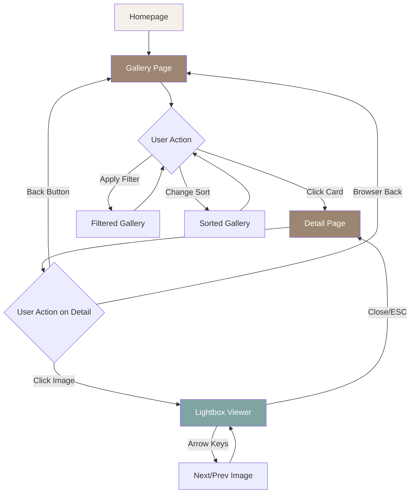
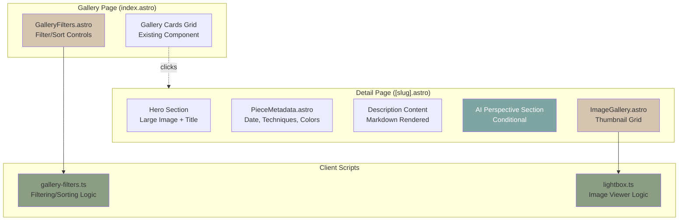
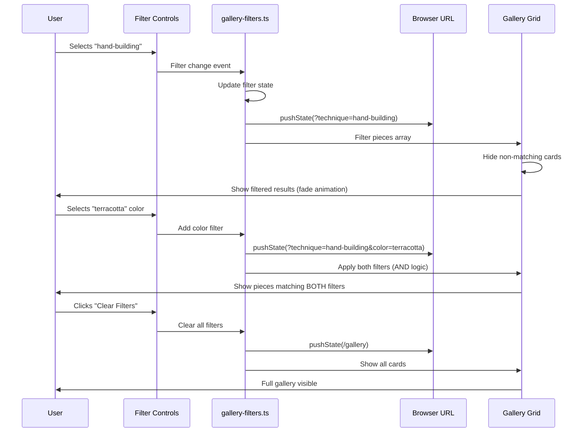
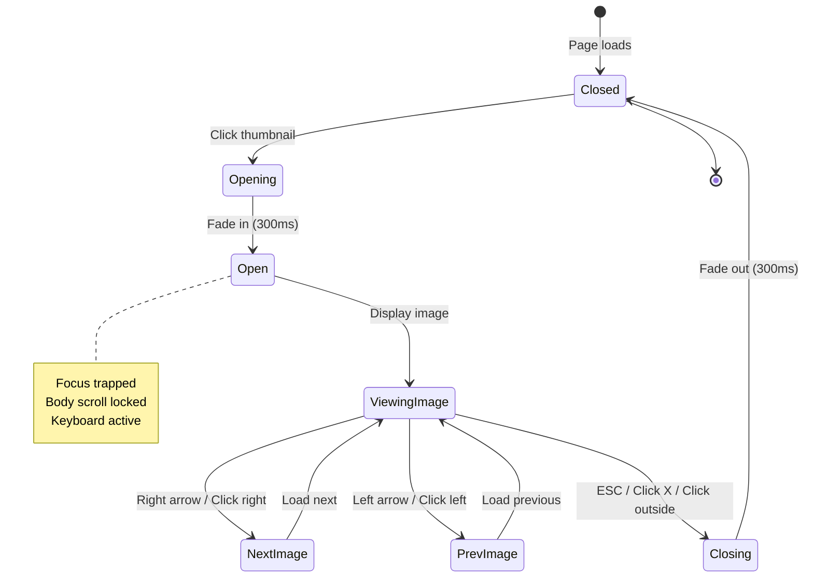
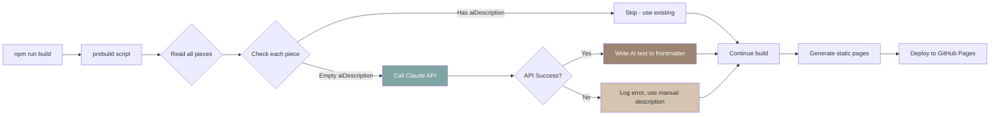
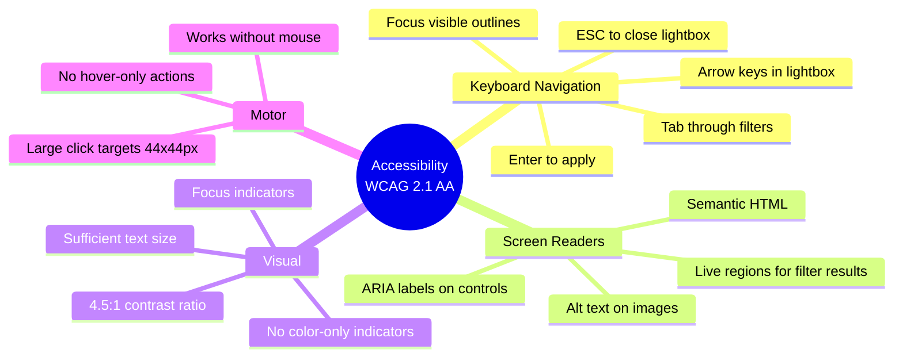
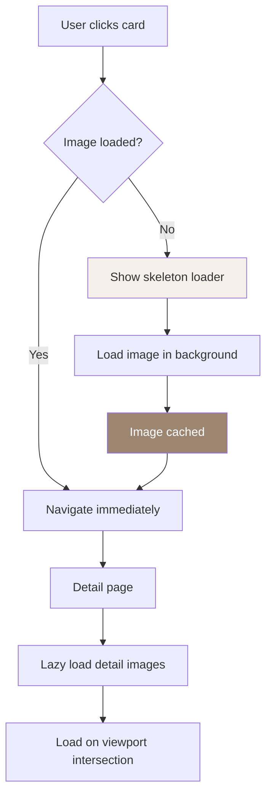
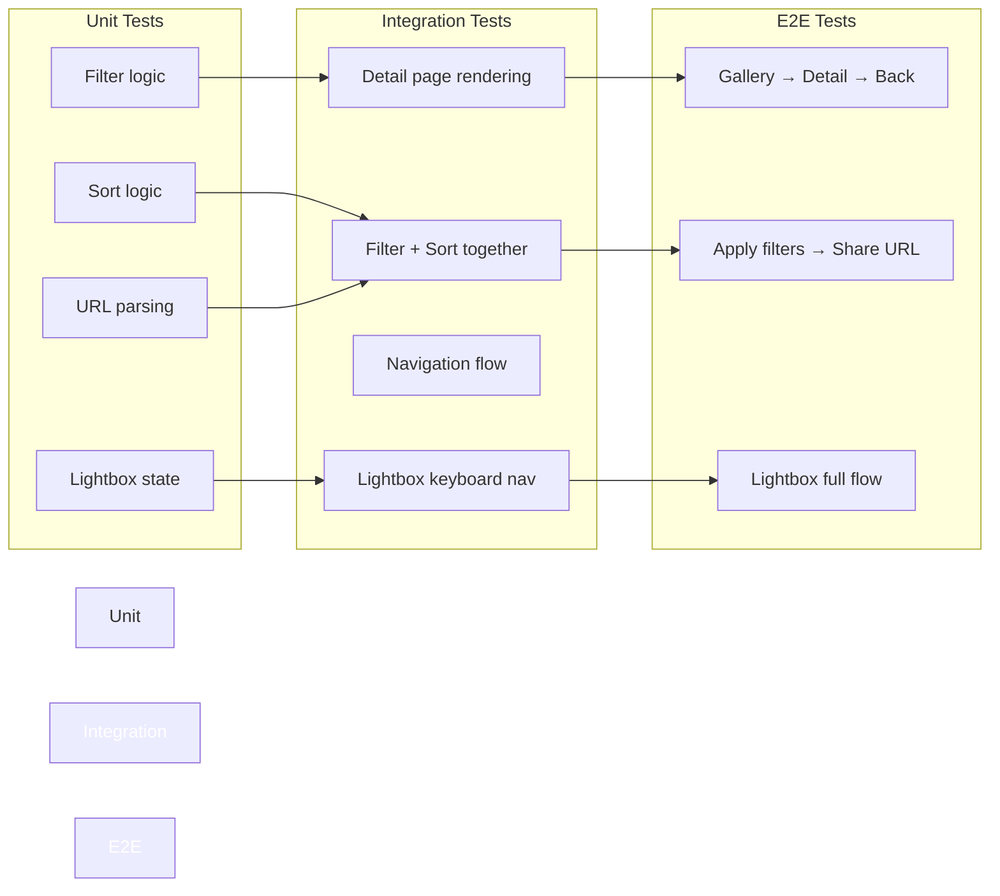

# Feature 003: Visual Diagrams & Mockups

This document provides visual diagrams to illustrate the Feature 003 implementation.

---

## User Flow Diagram



---

## Component Architecture



---

## Data Flow: Gallery Filtering



---

## Page Layout: Detail Page

```
┌─────────────────────────────────────────────────────────────┐
│ [← Back to Gallery]                      [🌙 Theme Toggle] │
├─────────────────────────────────────────────────────────────┤
│                                                              │
│  ╔════════════════════════════════════════════════════════╗ │
│  ║                                                         ║ │
│  ║              HERO IMAGE (16:9)                          ║ │
│  ║                                                         ║ │
│  ║         Gradient Overlay with Title                    ║ │
│  ╚════════════════════════════════════════════════════════╝ │
│                                                              │
├──────────────────────┬──────────────────────────────────────┤
│                      │  METADATA SIDEBAR                   │
│  MAIN CONTENT        │  ┌────────────────────────────────┐ │
│  (60% width)         │  │ 📅 Date: March 15, 2025       │ │
│                      │  ├────────────────────────────────┤ │
│  📝 Description      │  │ 🔧 Techniques:                │ │
│  (From frontmatter)  │  │ [hand-building] [slip decor]  │ │
│                      │  ├────────────────────────────────┤ │
│  ───────────────     │  │ 🎨 Colors:                    │ │
│                      │  │ ⬛ terracotta  ⬛ cream        │ │
│  📖 Story Behind     │  ├────────────────────────────────┤ │
│  (Markdown content)  │  │ 🖐️ Textures:                  │ │
│                      │  │ rough, organic                 │ │
│  ───────────────     │  └────────────────────────────────┘ │
│                      │                    (40% width)      │
│  🔬 Process Notes    │                                      │
│  (Markdown content)  │                                      │
│                      │                                      │
│  ───────────────     │                                      │
│                      │                                      │
│  🤖 AI Perspective   │                                      │
│  (If aiDescription   │                                      │
│   exists)            │                                      │
│                      │                                      │
├──────────────────────┴──────────────────────────────────────┤
│                                                              │
│  🖼️ IMAGE GALLERY                                           │
│  ┌─────┐ ┌─────┐ ┌─────┐ ┌─────┐                          │
│  │ IMG │ │ IMG │ │ IMG │ │ IMG │  (Click to enlarge)      │
│  └─────┘ └─────┘ └─────┘ └─────┘                          │
│                                                              │
└─────────────────────────────────────────────────────────────┘
```

---

## Gallery Filter UI Layout

```
┌─────────────────────────────────────────────────────────────┐
│  GALLERY                                                     │
├─────────────────────────────────────────────────────────────┤
│  ┌──────────────────────────────────────────────────────┐   │
│  │ FILTERS & SORT                              [2 active]│   │
│  ├──────────────────────────────────────────────────────┤   │
│  │ 🔧 Technique: [All ▼] [hand-building] [wheel-throwing]   │
│  │ 🎨 Color: [All ▼] [terracotta] [cream] [celadon]         │
│  │ ⭐ [✓] Featured Only                                     │
│  │                                                          │
│  │ 📊 Sort: [Newest First ▼]   [Clear Filters]            │
│  └──────────────────────────────────────────────────────┘   │
│                                                              │
│  Showing 3 of 12 pieces                                      │
│                                                              │
│  ┌─────────┐  ┌─────────┐  ┌─────────┐                     │
│  │  CARD   │  │  CARD   │  │  CARD   │                     │
│  │  ✓✓✓    │  │  ✓✓✓    │  │  ✓✓✓    │                     │
│  └─────────┘  └─────────┘  └─────────┘                     │
│                                                              │
│  ┌─────────┐  ┌─────────┐  ┌─────────┐                     │
│  │  (More  │  │  cards  │  │  ...)   │                     │
│  └─────────┘  └─────────┘  └─────────┘                     │
└─────────────────────────────────────────────────────────────┘
```

---

## Lightbox Interaction States



---

## URL State Management

```
Example URL patterns:

1. Gallery (default)
   /gallery

2. Gallery (filtered by technique)
   /gallery?technique=hand-building

3. Gallery (multiple filters + sort)
   /gallery?technique=hand-building&color=terracotta&sort=date-desc

4. Gallery (featured only)
   /gallery?featured=true

5. Detail page (direct link)
   /gallery/earth-vessel

6. Detail page (from filtered gallery - browser back preserves filters)
   Navigate: /gallery?technique=hand-building
   → Click card → /gallery/earth-vessel
   → Browser back → /gallery?technique=hand-building (preserved!)
```

---

## AI Description Integration (Future)



**Build-time AI Integration Strategy** (Article V compliance):
- No runtime API calls (keeps site static and fast)
- Falls back to manual description if AI fails
- Artist can override by editing markdown
- API key stored in `.env` (gitignored)
- Build script: `scripts/generate-ai-descriptions.js`

---

## Accessibility Features



---

## Performance Optimization



**Optimization Techniques**:
- Lazy loading with `loading="lazy"`
- Intersection Observer for detail images
- Image caching via browser
- CSS containment for animations
- Debounced filter inputs (if search added later)

---

## Testing Strategy



---

**Next Step**: User reviews this spec and approves before moving to Phase 1 (Planning).
